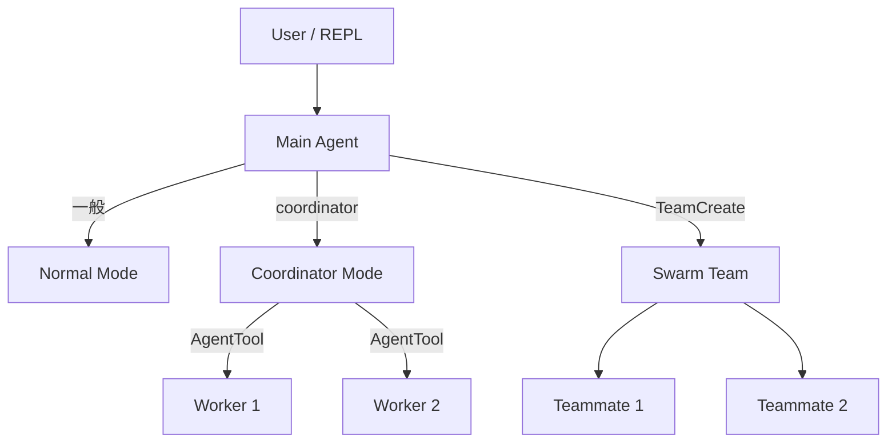

# Agent Architecture MOC

> 三層架構、多 Agent 協作、任務系統

## 核心概念

- [[Agent 系統三層架構]] — User/REPL → Main Agent → Workers
- [[6 Built-in Agents 索引]] — 6 個內建 Agent 類型
- [[Agent 生命週期]] — Spawn → Execute → Return → Cleanup
- [[Swarm 與 Teammate 多 Agent 協作]] — Mailbox 通訊、pane-based 執行
- [[Task 系統與狀態機]] — 7 種 Task 類型、狀態流轉
- [[Agent 間通訊機制]] — 4 種通訊方式

## 設計模式

- [[並行與 Async Generator 模式]] — Agent 並行策略

## 參考索引

- [[6 Built-in Agents 索引]] — Agent 模型、工具集、用途

## Agent 系統層次

## 關聯 MOC

- [[Harness Engineering MOC]] — Agent Loop 是 Harness 的 Action Interface
- [[Tool System MOC]] — AgentTool 是工具系統的一部分
- [[Memory & Context MOC]] — Agent 間的 Context 隔離

---

> [!tip] 導航
> 返回 [[Claude Code 逆向工程知識庫]]
