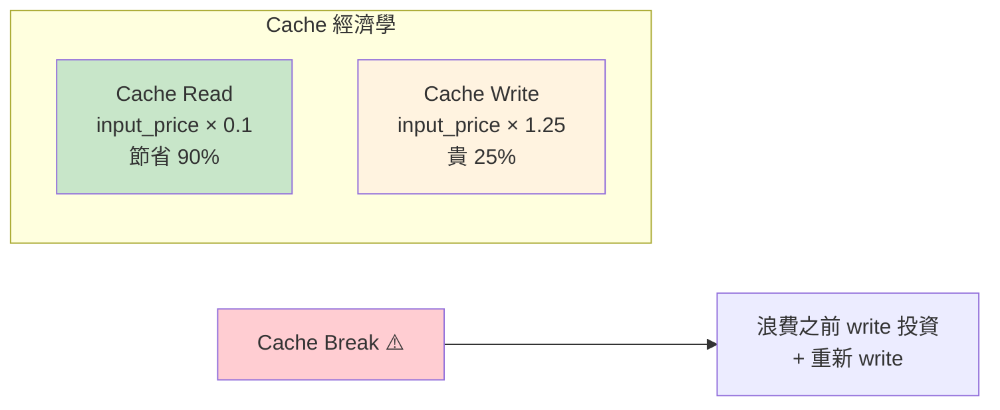
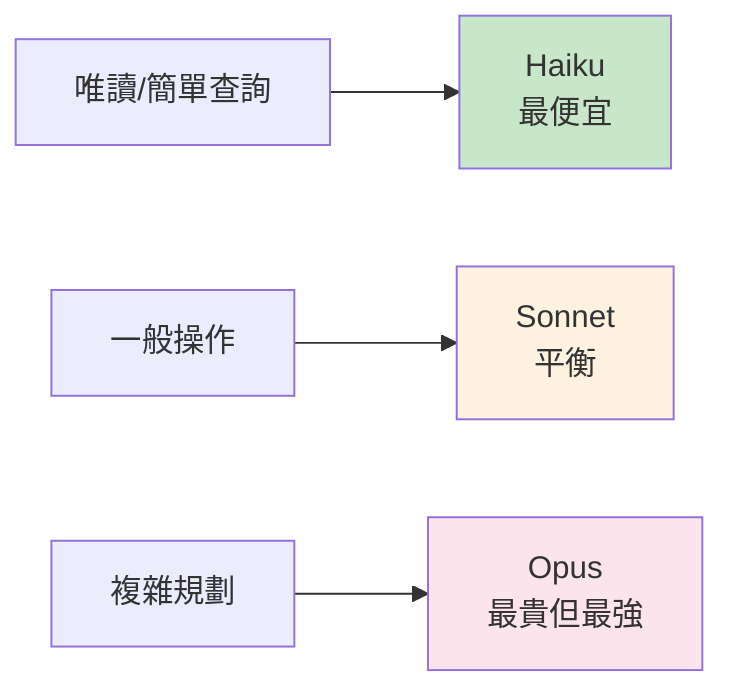

# Cost Engineering MOC

> 成本追蹤、Cache 策略、Rate Limiting、模型路由

## 核心概念

- [[成本追蹤架構]] — 精確的 token/成本追蹤
- [[Prompt Cache 策略與 Break Detection]] — 兩階段偵測 + 原因診斷
- [[Rate Limiting 三層額度管控]] — API / Application / Policy 三層
- [[Token Estimation 預估邏輯]] — Context 預算計算
- [[Policy Limits 團隊管控]] — 組織級配額管控
- [[Model Selection 與成本路由]] — 用最便宜的能勝任的模型

## 設計模式

- [[Cache 穩定性工程模式]] — 7 個 Cache 穩定性模式

## 相關概念

- [[API 呼叫層架構]] — API 層的成本計算
- [[模型配置與 Provider 支援]] — 多 Provider 定價
- [[Beta Features 與 Feature Flags 系統]] — Feature Flags 與計費

## Cache 經濟學

## 成本路由原則

## 關聯 MOC

- [[Harness Engineering MOC]] — Cache 是 Harness 的核心工程需求
- [[Prompt Engineering MOC]] — Prompt 設計影響 Cache

---

> [!tip] 導航
> 返回 [[Claude Code 逆向工程知識庫]]
