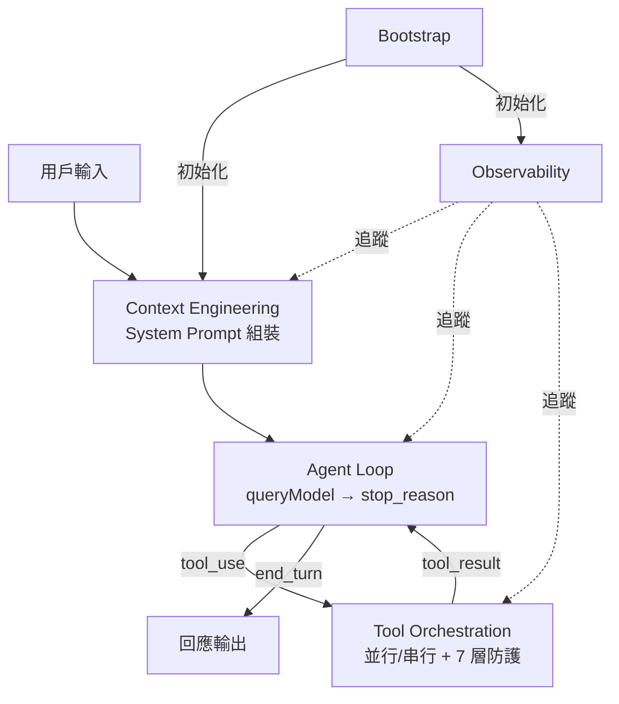

# Harness Engineering MOC

> Harness = Tools + Knowledge + Observation + Action Interfaces + Permissions

## 核心概念

- [[Harness Engineering 定義與公式]] — 學科定義與公式
- [[Agent Loop 核心執行機制]] — 核心驅動迴圈
- [[Context Engineering 多層管道]] — 六大 Context 管道
- [[Tool Orchestration 調度系統]] — 工具並行/串行編排
- [[Coordinator Mode 多 Agent 協調]] — 多 Agent 調度
- [[Bootstrap 啟動流程與生命週期]] — 啟動管道與 STATE
- [[Observability 三層可觀測性架構]] — 三層遙測架構

## 設計模式

- [[Harness Engineering 12 原則]] — 12 條可遷移原則
- [[Cache 穩定性工程模式]] — Prompt Cache 穩定性設計
- [[並行與 Async Generator 模式]] — 非同步與並行設計
- [[PII 安全型別系統模式]] — 型別系統防 PII 洩漏

## 關鍵架構圖

## 關聯 MOC

- [[Prompt Engineering MOC]] — Context Engineering 的子集
- [[Tool System MOC]] — Tools 組件
- [[Security & Permissions MOC]] — Permissions 組件
- [[Cost Engineering MOC]] — Cache 穩定性

---

> [!tip] 導航
> 返回 [[Claude Code 逆向工程知識庫]]
