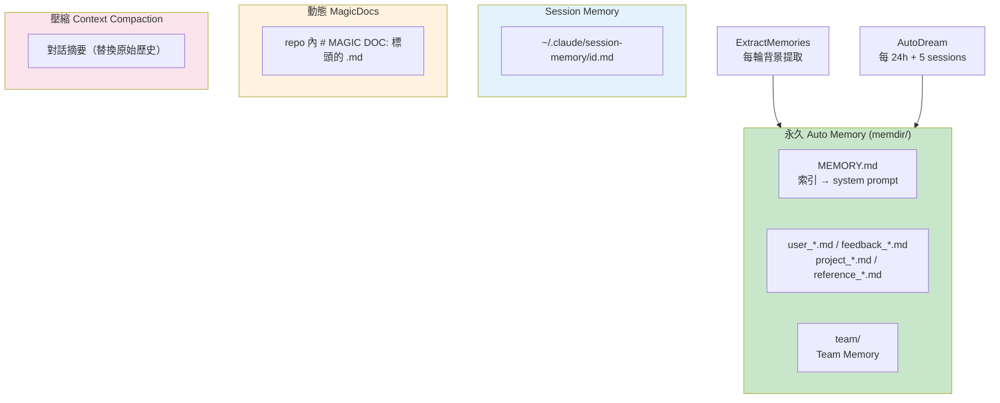

# Memory & Context MOC

> 五大記憶子系統、Memdir 核心、設計原則

## 核心概念

- [[Memory 五大子系統架構]] — 系統總覽與資料流
- [[Memdir 核心與 MEMORY.md]] — 永久記憶目錄結構
- [[ExtractMemories 自動記憶提取]] — 背景增量提取
- [[Session Memory 即時快照]] — Session 級別筆記
- [[AutoDream 夢境記憶整合]] — 跨 Session 記憶鞏固
- [[Team Memory 跨用戶共享]] — 團隊記憶同步
- [[MagicDocs 動態文件系統]] — 自動維護 repo 文件

## 設計模式

- [[Memory 設計原則集]] — 12 條記憶系統設計原則

## 記憶系統層次

## 記憶類型

| 類型 | 說明 | 範例 |
|------|------|------|
| `user` | 使用者角色、目標 | 偏好、背景知識 |
| `feedback` | 指導原則（正 + 反）| 糾正 + 確認 |
| `project` | 專案目標、決策 | 里程碑、設計決策 |
| `reference` | 外部系統指標 | Linear、Grafana URL |

## 關聯 MOC

- [[Prompt Engineering MOC]] — 記憶注入 System Prompt
- [[Harness Engineering MOC]] — 記憶是 Harness 的 Knowledge

---

> [!tip] 導航
> 返回 [[Claude Code 逆向工程知識庫]]
