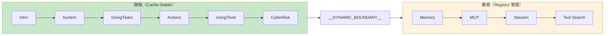

# Prompt Engineering MOC

> System Prompt 的動態組裝、壓縮策略、輔助子系統

## 核心概念

- [[System Prompt 動態組裝邏輯]] — 靜態/動態分隔、多層組裝
- [[Context Compaction 壓縮策略]] — 三明治強化、Scratchpad
- [[輔助 Prompt 子系統]] — 5 大輔助 prompt（Memory、Session、MagicDocs、AutoDream、Buddy）
- [[Cyber Risk 安全指令]] — AI 層安全指令

## 設計模式

- [[Prompt Engineering 設計模式集]] — 17 個可遷移模式

## 關鍵設計

## 關聯 MOC

- [[Harness Engineering MOC]] — Prompt 是 Harness 的 Knowledge 組件
- [[Memory & Context MOC]] — 記憶內容注入 System Prompt
- [[Cost Engineering MOC]] — Prompt 設計影響 Cache

---

> [!tip] 導航
> 返回 [[Claude Code 逆向工程知識庫]]
