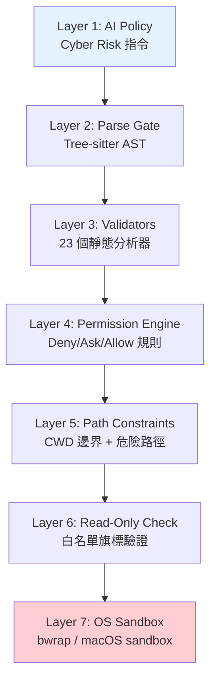

# Security & Permissions MOC

> 七層縱深防禦、AST 解析、權限引擎、沙箱隔離

## 核心概念

- [[七層縱深防禦模型]] — 7 層安全架構總覽
- [[Bash 命令安全過濾與 AST 解析]] — Tree-sitter AST + 23 Validators
- [[權限規則引擎]] — Deny/Ask/Allow 規則 + Race 模式
- [[Sandbox 沙箱隔離機制]] — OS 層級檔案系統 + 網路隔離
- [[唯讀模式與檔案系統權限]] — 白名單旗標驗證 + 路徑偵測

## 設計模式

- [[Security 設計模式集]] — 10 個可遷移安全模式
- [[Fail-Closed 與 Deny-First 原則]] — 跨領域安全原則

## 七層防禦一覽

## 關聯 MOC

- [[Tool System MOC]] — BashTool 涵蓋所有 7 層
- [[Harness Engineering MOC]] — Permissions 是 Harness 公式的一部分

---

> [!tip] 導航
> 返回 [[Claude Code 逆向工程知識庫]]
