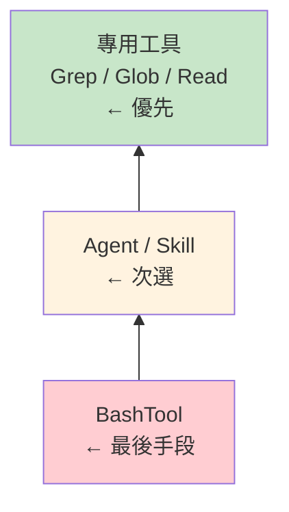

# Tool System MOC

> 36 個工具、Skills 系統、工具執行防護管道

## 核心概念

- [[36 工具系統總覽]] — 工具分類與結構
- [[BashTool 深度剖析]] — 最複雜的核心工具（5000+ 行安全碼）
- [[AgentTool 與 Subagent 派遣]] — 多 Agent 調度入口
- [[SkillTool 與 Skills 系統]] — Skills 系統橋接器
- [[Skills vs Tools 設計哲學]] — 工具 vs 技能的本質差異
- [[工具執行多層防護管道]] — 7 層執行管道

## 設計模式

- [[Tool Prompt 設計模式集]] — 12 個工具 Prompt 設計模式
- [[Hook 系統擴展模式]] — Pre/Post Hook 擴展

## 參考索引

- [[36 工具完整索引表]] — 完整工具清單
- [[16 Bundled Skills 目錄]] — 內建技能清單

## 工具偏好金字塔

## 關聯 MOC

- [[Harness Engineering MOC]] — Tools 是 Harness 公式的核心
- [[Agent Architecture MOC]] — AgentTool 連接 Agent 系統
- [[Security & Permissions MOC]] — 工具安全防護

---

> [!tip] 導航
> 返回 [[Claude Code 逆向工程知識庫]]
