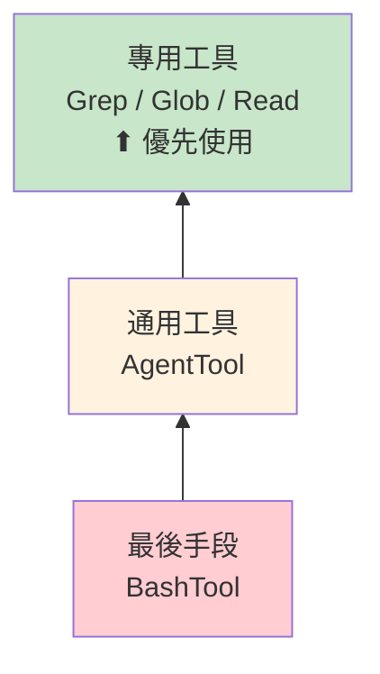

# 36 工具系統總覽

## 概述

Claude Code 包含 36 個工具，每個工具都是一個標準化的 `Tool<InputSchema, Output>` 介面實作。工具是模型與外部世界互動的**原子能力**，對應 Anthropic API 的 `tool_use` / `tool_result` 機制。

## 工具的結構

```typescript
export const SomeTool: Tool<InputSchema, Output> = buildTool({
  name: 'ToolName',
  inputSchema: z.object({ ... }),          // Zod schema 驗證
  async call(input, context) { ... },       // 實際執行
  async checkPermissions(input, ctx) { ... }, // 權限檢查
  async validateInput(input, ctx) { ... },  // 自訂驗證
})
```

## 分類體系

| 類別 | 工具數 | 代表工具 | 特性 |
|------|-------|---------|------|
| **核心工具** | 8 | Bash, Read, Edit, Write, Grep, Glob, Agent, Skill | 常駐載入 |
| **規劃/任務** | 4 | EnterPlanMode, Todo | 狀態機驅動 |
| **Agent 通訊** | 4 | SendMessage, ToolSearch, Worktree | 多 Agent 支援 |
| **Task 管理** | 4 | TaskCreate/Update/Get/Stop | 非同步任務 |
| **外部整合** | 4 | WebFetch, WebSearch, MCP, ScheduleCron | 外部資源 |
| **團隊/設定** | 6 | TeamCreate, Config, Sleep, LSP, Brief | 管理功能 |
| **其他** | 6 | PowerShell, AskUser, Notebook, etc. | 特殊場景 |

→ 完整清單見 [[36 工具完整索引表]]

## 工具偏好金字塔

系統在 prompt 中明確建立工具使用的優先序：



> [!important] 核心原則
> 每個工具的 prompt 中都會說明「何時不要用我，改用哪個工具」。這防止模型用 BashTool 做所有事情。

→ 詳見 [[Tool Prompt 設計模式集]] 模式 1

## 工具的 Prompt 成本

工具 prompt 是 context window 的重要消耗。最大的 prompt：

| 工具 | Prompt 行數 | 說明 |
|------|------------|------|
| BashTool | 369 | 安全規則、git protocol、sandbox 指引 |
| AgentTool | 287 | Agent 列表、fork/spawn 語義 |
| SkillTool | 241 | Skill 清單、觸發規則 |
| TodoWriteTool | 184 | 狀態機、格式要求 |
| EnterPlanMode | 170 | When to use/not use |

→ 詳見 [[Tool Prompt 設計模式集]] 模式 10（預算感知設計）

## 工具與 Skills 的區別

| 維度 | Tool | Skill |
|------|------|-------|
| 本質 | TypeScript 程式碼 | Markdown prompt 模板 |
| 執行者 | 程式碼直接執行 | 模型閱讀後間接執行 |
| 輸入 | JSON（Zod schema）| 字串 |
| 擴展門檻 | 需要 TypeScript 開發 | 只需寫 SKILL.md |

→ 詳見 [[Skills vs Tools 設計哲學]]

## 關聯筆記

- [[Tool Orchestration 調度系統]] — 工具的執行編排
- [[工具執行多層防護管道]] — 每個工具呼叫的安全管道
- [[BashTool 深度剖析]] — 最複雜的核心工具
- [[AgentTool 與 Subagent 派遣]] — 多 Agent 派遣工具
- [[SkillTool 與 Skills 系統]] — Skills 系統入口

---

> [!tip] 導航
> 返回 [[Tool System MOC]] · [[Claude Code 逆向工程知識庫]]
