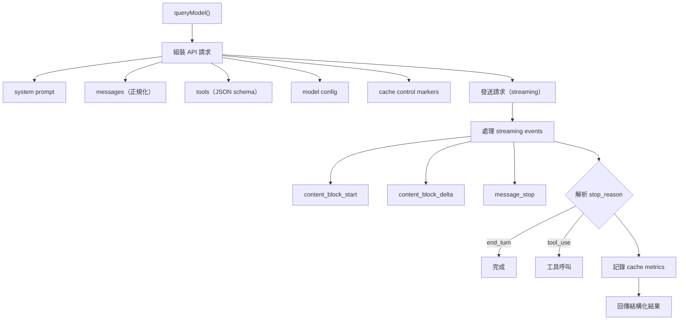

# API 呼叫層架構

## 概述

`src/services/api/claude.ts`（3419 行）是 Claude Code 與 Anthropic API 之間的核心中介層。它負責請求組裝、streaming 處理、重試策略、cache 管理和回應解析。

## 主要職責



## Streaming 處理

API 回應以 Server-Sent Events (SSE) 方式 streaming：

```typescript
for await (const event of stream) {
  switch (event.type) {
    case 'content_block_start':
      // 新的 content block 開始（text 或 tool_use）
      break
    case 'content_block_delta':
      // 增量內容（text delta 或 tool input JSON delta）
      yield partialResult
      break
    case 'message_stop':
      // 完整回應結束
      break
  }
}
```

## 重試策略

| 錯誤類型 | 策略 |
|----------|------|
| 429 (Rate Limited) | 指數退避，respect `retry-after` header |
| 529 (Overloaded) | 較長退避間隔 |
| 5xx (Server Error) | 退避重試，最多 3 次 |
| 網路錯誤 | 退避重試 |
| 4xx (Client Error) | 不重試，回傳錯誤 |

## Extended Thinking 支援

```typescript
if (model.supportsExtendedThinking) {
  // 啟用 thinking blocks
  // thinking content 在 streaming 中以 thinking_delta 傳遞
  // 不計入 output tokens（特殊計費）
}
```

## Cache Control Markers

在 API 請求中插入 `cache_control` 標記：

```json
{
  "system": [
    { "type": "text", "text": "...", "cache_control": { "type": "ephemeral" } }
  ],
  "messages": [
    { "role": "user", "content": "...", "cache_control": { "type": "ephemeral" } }
  ]
}
```

→ 詳見 [[Prompt Cache 策略與 Break Detection]]

## 關聯筆記

- [[Agent Loop 核心執行機制]] — API 層是 Agent Loop 的核心呼叫點
- [[Context Engineering 多層管道]] — API 請求的 context 組裝
- [[Prompt Cache 策略與 Break Detection]] — Cache 管理
- [[模型配置與 Provider 支援]] — 多 provider 支援
- [[成本追蹤架構]] — 從 API response 解析成本

---

> [!tip] 導航
> 返回 [[Cost Engineering MOC]] · [[Claude Code 逆向工程知識庫]]
