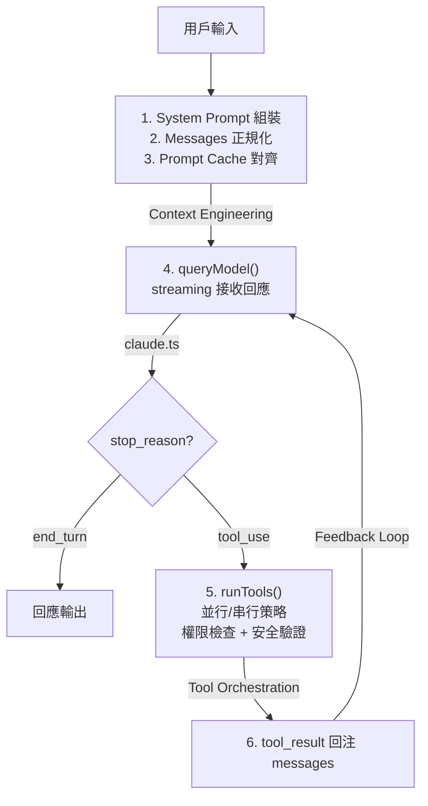

# Agent Loop 核心執行機制

## 概述

Agent Loop 是 Claude Code 的核心驅動機制。它不是簡單的問答循環，而是帶有完整狀態管理、工具執行緩衝、feedback 注入的有狀態執行機。

## 整體流程

## 關鍵入口點

### `queryModel()`
- 位於 `src/services/api/claude.ts`（3419 行）
- 負責組裝 API 請求、streaming 處理、cache header 管理
- 回傳 `stop_reason`：`end_turn`（完成）或 `tool_use`（需要工具）

### `runTools()`
- 位於 `src/services/tools/toolOrchestration.ts`
- 決定並行或串行執行策略
- 走完多層安全防護管道後執行工具

→ 詳見 [[Tool Orchestration 調度系統]]

## Feedback Loop 機制

Agent Loop 的核心價值在於 feedback loop：

1. **工具結果回注**：tool_result 作為 `user` role 訊息回注到 messages
2. **診斷注入**：IDE 的 LSP diagnostics 在檔案編輯後注入
3. **Interrupt 處理**：用戶中斷、token 超限、權限拒絕都能優雅處理
4. **Context 壓縮**：對話過長時觸發 [[Context Compaction 壓縮策略]]

## 中斷機制

| 中斷類型 | 觸發條件 | 處理方式 |
|----------|---------|---------|
| 用戶中斷 | Ctrl+C / ESC | 優雅停止，保留已有結果 |
| Token 超限 | context window 接近上限 | 觸發 compaction |
| 權限拒絕 | 用戶拒絕工具權限 | tool_result 回傳錯誤，模型重新決策 |
| API 錯誤 | 429 / 529 / 網路錯誤 | 指數退避重試 |

## 設計觀察

> [!info] 關鍵設計決策
> - **Streaming**：回應以 streaming 方式接收，提供即時反饋
> - **Async Generator**：整個 loop 使用 async generator 模式，允許中間狀態逐步 yield
> - **Stop Reason 驅動**：loop 的繼續/終止完全由 API 回傳的 stop_reason 決定
> - **Stateful**：每個 turn 的 messages 累積形成完整的對話歷史

## 🔬 最小實作參考（claw-code）

> [!example] claw-code 最小骨幹 — PortRuntime
> 來源：`claw-code/src/runtime.py`（~200 行）

![[runtime-implementation#^code-core]]

**為什麼這個 stub 能闡明本概念**：
`PortRuntime.route_prompt()` 和 `run_turn_loop()` 將 Agent Loop 的核心三階段——路由、執行、回合管理——壓縮到兩個方法中。讀者能一眼看清 `stop_reason` 驅動的迴圈控制，不被 streaming、error handling 等細節干擾。

**本概念的 stub 未呈現的**：
- Streaming 回應（async generator + SSE）
- Context Engineering 六大管道的 System Prompt 組裝
- 真正的 LLM API 呼叫（stub 使用 token 匹配模擬路由）

→ 完整程式碼走讀 + 差距分析：[[runtime-implementation]]

---

> [!example] claw-code 最小骨幹 — QueryEnginePort
> 來源：`claw-code/src/query_engine.py`（~180 行）

![[query-engine-implementation#^code-core]]

**為什麼這個 stub 能闡明本概念**：
`QueryEnginePort` 保留了 `claude.ts`（3419 行）的三大核心職責：訊息提交（submit）、串流支援（stream）、會話持久化（persist）。`TurnResult` 的 `stop_reason` 欄位完美映射了 Agent Loop 的「繼續或停止」決策點。

**本概念的 stub 未呈現的**：
- 真正的 HTTP/SSE 串流解碼
- Prompt Cache header 管理與 break detection
- 429/529 重試與指數退避

→ 完整程式碼走讀 + 差距分析：[[query-engine-implementation]]

## 關聯筆記

- [[Context Engineering 多層管道]] — Agent Loop 的「輸入準備」階段
- [[Tool Orchestration 調度系統]] — Agent Loop 的「工具執行」階段
- [[Observability 三層可觀測性架構]] — Agent Loop 每個階段的追蹤
- [[Harness Engineering 定義與公式]] — Agent Loop 是 Harness 的 Action Interface
- [[runtime-implementation]] — PortRuntime 完整實作筆記
- [[query-engine-implementation]] — QueryEnginePort 完整實作筆記

---

> [!tip] 導航
> 返回 [[Harness Engineering MOC]] · [[Claude Code 逆向工程知識庫]]
