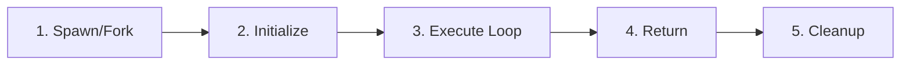
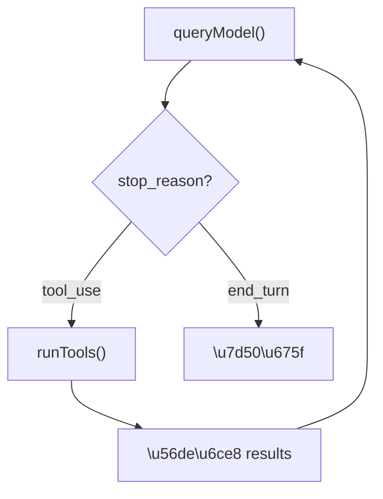

# Agent 生命週期

## 概述

每個 Agent（包括主 agent 和 subagent）都遵循完整的生命週期：從建立到執行、結果回傳、到最終清理。

## 生命週期階段



### 1. Spawn / Fork

| 方式 | 機制 | Context |
|------|------|---------|
| **Spawn** | 建立全新 agent | 空白 context |
| **Fork** | 繼承父 agent | 共享 prompt cache |

→ 詳見 [[AgentTool 與 Subagent 派遣]]

### 2. Initialize

- 載入對應的 system prompt（built-in agent 有自己的 prompt）
- 設定工具集（可能限制為唯讀工具）
- 設定模型（某些 agent 使用 Haiku 而非 Sonnet）
- 建立 OTel span

### 3. Execute Loop

Agent 進入 [[Agent Loop 核心執行機制|Agent Loop]]：



**背景模式**：每 30 秒生成 AgentSummary（進度摘要）

### 4. Return

結果回傳方式取決於執行模式：

| 模式 | 回傳方式 |
|------|---------|
| 前景 | 直接回傳 result 字串 |
| 背景 | 以 `<task-notification>` XML 注入父對話 |

```xml
<task-notification>
Agent general-purpose completed task: "實作登入功能"
Result: 已建立 login.tsx，通過所有測試
</task-notification>
```

### 5. Cleanup

- 結束 OTel span
- 釋放 worktree（如果使用）
- 更新 Task 狀態

## AgentSummary 機制

長時間運行的 agent 需要定期回報進度：

```typescript
// 每 30 秒觸發一次
const summary = await runForkedAgent({
  task: "summarize current progress",
  maxTokens: small,  // 短摘要
})
// 摘要注入父對話，讓 coordinator 知道進度
```

## 中斷處理

| 中斷來源 | 處理 |
|----------|------|
| 用戶 Ctrl+C | 優雅停止，保留已有結果 |
| TaskStopTool | Coordinator 主動停止 worker |
| Token 超限 | 觸發 compaction 或結束 |
| 超時 | 回傳超時訊息 |

## 關聯筆記

- [[Agent 系統三層架構]] — Agent 在整體架構中的位置
- [[AgentTool 與 Subagent 派遣]] — Spawn/Fork 的具體機制
- [[Task 系統與狀態機]] — Task 狀態的流轉
- [[Coordinator Mode 多 Agent 協調]] — 背景模式的主要使用場景

---

> [!tip] 導航
> 返回 [[Agent Architecture MOC]] · [[Claude Code 逆向工程知識庫]]
