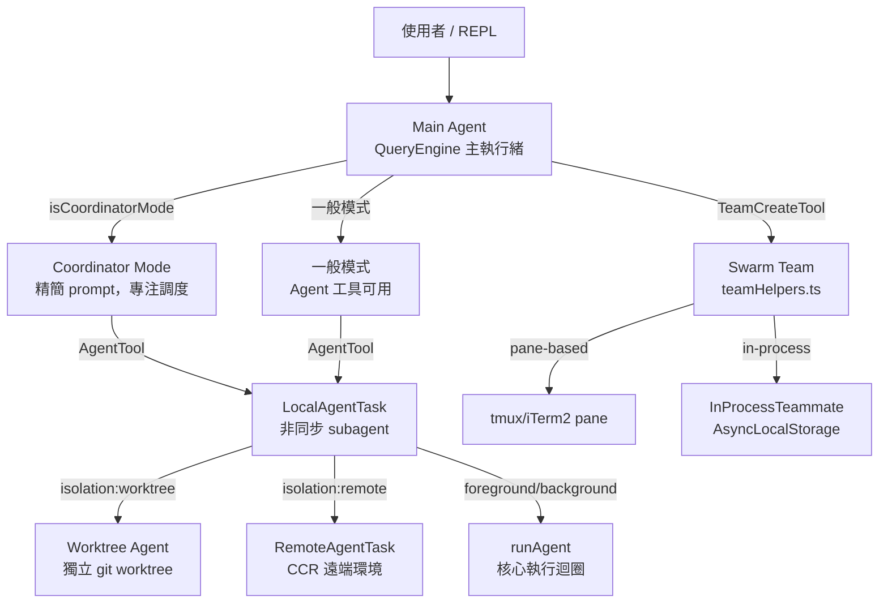
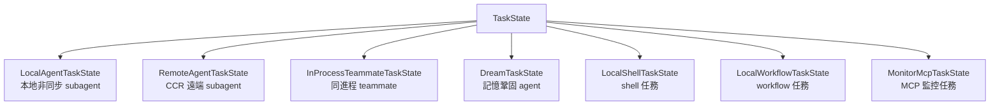

# Agent 系統三層架構

## 概述

Claude Code 的 Agent 系統由三個主要層次構成，從用戶介面到底層執行形成完整的調度體系。

## 三層架構圖

## 層次說明

### Layer 1: 使用者介面層
- **REPL**（`screens/REPL.tsx`）：CLI 互動介面
- 接收用戶輸入，啟動 QueryEngine

### Layer 2: 主 Agent 層
- **Main Agent**：QueryEngine 主執行緒，運行 [[Agent Loop 核心執行機制|Agent Loop]]
- 兩種模式：
  - **一般模式**：自行決定是否派遣 subagent
  - **Coordinator 模式**：專注於任務分解和調度

→ 詳見 [[Coordinator Mode 多 Agent 協調]]

### Layer 3: Worker Agent 層
- **LocalAgentTask**：本地非同步 subagent
- **RemoteAgentTask**：CCR 遠端 subagent
- **InProcessTeammateTask**：同進程 teammate（AsyncLocalStorage 隔離）

## 執行模式切換

| 模式 | 觸發條件 | 特性 |
|------|---------|------|
| 一般模式 | 預設 | Agent 工具可用，自行決定 |
| Coordinator | `COORDINATOR_MODE=1` | 精簡 prompt，專注調度 |
| Fork | `isForkSubagentEnabled()` | 繼承 context + cache |
| In-process | `isInProcessTeammate()` | AsyncLocalStorage 隔離 |

## Task 類型體系

→ 詳見 [[Task 系統與狀態機]]

## 隔離策略

| 策略 | 機制 | 適用場景 |
|------|------|---------|
| **同進程** | AsyncLocalStorage | 快速、低開銷 |
| **Worktree** | 獨立 git worktree | 需要 git 隔離 |
| **Remote** | CCR 沙箱 | 需要完全隔離 |

## 關聯筆記

- [[Coordinator Mode 多 Agent 協調]] — Layer 2 的 Coordinator 模式
- [[AgentTool 與 Subagent 派遣]] — 派遣 subagent 的工具
- [[Swarm 與 Teammate 多 Agent 協作]] — Team/Swarm 系統
- [[Agent 生命週期]] — Agent 的完整生命流程
- [[6 Built-in Agents 索引]] — 可用的 agent 類型

---

> [!tip] 導航
> 返回 [[Agent Architecture MOC]] · [[Claude Code 逆向工程知識庫]]
