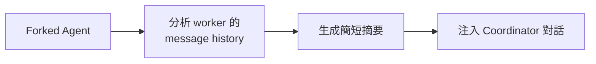

# Agent 間通訊機制

## 概述

Claude Code 中的多 Agent 系統需要多種通訊方式來支援不同的協作模式。通訊機制的設計核心原則是**顯式通訊**——普通文字輸出不會自動傳遞給其他 agent。

## 通訊方式一覽

| 方式 | 使用場景 | 機制 |
|------|---------|------|
| **AgentTool 回傳** | Coordinator → Worker 結果 | `<task-notification>` XML |
| **SendMessageTool** | Teammate 間通訊 | Mailbox 信箱 |
| **UDS Inbox** | 跨 Session 通訊 | Unix Domain Socket |
| **AgentSummary** | 背景 Agent 進度 | Forked agent 摘要 |

## AgentTool 回傳（task-notification）

Worker agent 完成後的標準回傳格式：

```xml
<task-notification>
Agent general-purpose completed task: "實作登入功能"
Result: 已建立 login.tsx 和 auth.ts，通過所有測試。
主要變更：
- 新增 JWT 驗證中介層
- 新增 /login 和 /logout 端點
</task-notification>
```

- 以 `user` role 注入父對話
- Coordinator 看到後決定下一步行動
- 背景模式下，completion 通知是非同步的

## SendMessageTool

```
Your plain text output is NOT visible to other agents.
To communicate, you MUST call this tool.
```

**設計要點**：
- 普通 text output 只對當前 agent 的 detail view 可見
- 其他 agent 或 leader 只能透過 SendMessageTool 收到訊息
- 防止「回答藏在 detail view 裡而用戶看不到」的失敗模式

→ 詳見 [[Tool Prompt 設計模式集]] 模式 12（通訊可見性契約）

## UDS Inbox（跨 Session）

```typescript
// Feature flag: UDS_INBOX
// 透過 Unix Domain Socket 實現跨 session 通訊
```

允許不同 Claude Code session 之間傳遞訊息，實現跨 session 協作。

## AgentSummary（進度回報）

長時間背景 agent 每 30 秒生成摘要：



## 通訊設計原則

> [!info] 核心原則
> 1. **顯式通訊**：不假設 text output 會傳遞
> 2. **結構化格式**：XML tag 確保解析正確
> 3. **非同步安全**：Mailbox 支援非同步收發
> 4. **可見性契約**：每個通訊管道明確聲明可見範圍

## 關聯筆記

- [[Coordinator Mode 多 Agent 協調]] — task-notification 的主要場景
- [[Swarm 與 Teammate 多 Agent 協作]] — Mailbox 通訊
- [[Agent 生命週期]] — 回傳是生命週期的 Return 階段
- [[Tool Prompt 設計模式集]] — 模式 12（通訊可見性契約）

---

> [!tip] 導航
> 返回 [[Agent Architecture MOC]] · [[Claude Code 逆向工程知識庫]]
