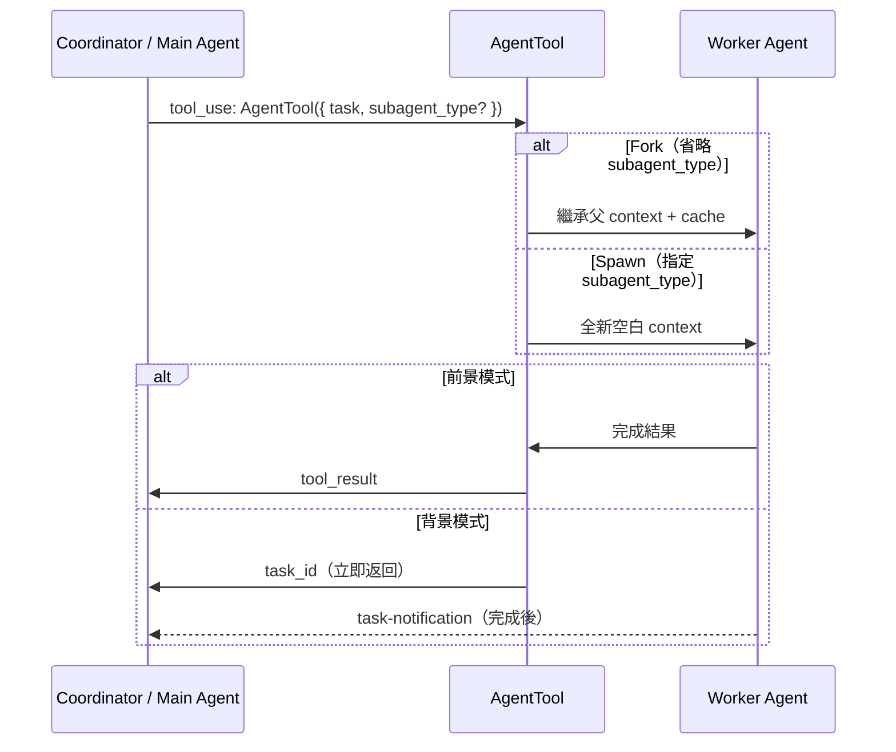

# AgentTool 與 Subagent 派遣

## 概述

AgentTool 是 Claude Code 的多 Agent 調度入口，允許主 agent 派遣 subagents 執行子任務。它是 [[Coordinator Mode 多 Agent 協調|Coordinator Mode]] 和一般多 agent 工作流的核心工具。

## Prompt 結構（287 行）

AgentTool prompt 動態生成，包含：
1. **Agent 列表**：可用的 agent 類型及說明
2. **When to Use / NOT to Use**：觸發規則
3. **Fork vs Spawn 語義**（feature flag 控制）
4. **並行指引**

## 派遣流程



## Fork vs Spawn

| 模式 | 機制 | 優點 | 適用 |
|------|------|------|------|
| **Fork** | 繼承父 context + prompt cache | 便宜（cache 複用） | 需要父 context 的任務 |
| **Spawn** | 全新空白 context | 乾淨（無干擾） | 獨立的子任務 |

```typescript
// Fork：省略 subagent_type 即 fork 自身
AgentTool({ task: "..." })

// Spawn：指定 subagent_type
AgentTool({ task: "...", subagent_type: "explore" })
```

## 6 個 Built-in Agents

→ 詳見 [[6 Built-in Agents 索引]]

| Agent | 用途 | 模型 |
|-------|------|------|
| general-purpose | 通用全工具 | 繼承 |
| explore | 唯讀探索 | Haiku |
| plan | 架構規劃 | 繼承 |
| verification | 測試驗證 | 繼承 |
| claude-code-guide | 文件查詢 | Haiku |
| statusline-setup | 狀態列設定 | Sonnet |

## 背景/前景雙模式

```typescript
AgentTool({
  task: "...",
  run_in_background: true,  // 背景執行
})
```

- **前景**：coordinator 等待結果再繼續
- **背景**：coordinator 繼續其他工作，完成後收到 `<task-notification>`

## Agent 列表的 Cache 最佳化

Agent 列表是 AgentTool prompt 的重要組成部分，其注入方式影響 prompt cache：

```typescript
// 方式 1：Inline（在 tool schema 中）
//   缺點：MCP/plugin 變更 → 整個 tool schema cache bust

// 方式 2：Attachment（在 messages 中注入）
//   優點：tool schema 穩定 → cache 不受影響
//   節省：~10.2% fleet cache_creation tokens

shouldInjectAgentListInMessages() → 切換方式
```

→ 詳見 [[Cache 穩定性工程模式]]

## Anti-Patterns

> [!warning] 避免的模式
> - **Don't peek**：不要 Read/tail agent 的輸出，除非用戶要求
> - **Don't race**：不要預測或捏造 fork 的結果
> - **Don't nest**：外部版本禁用 AgentTool 遞迴

## 結果回傳

Worker agent 完成後，結果以 user-role `<task-notification>` XML 注入：

```xml
<task-notification>
Agent explore completed task: "分析 auth 模組"
Result: auth.ts 使用 JWT + refresh token 機制...
</task-notification>
```

## AgentSummary（進度摘要）

長時間運行的 agent 每 30 秒透過 forked agent 生成進度摘要，讓 coordinator 知道 worker 的當前狀態。

## 關聯筆記

- [[Agent 系統三層架構]] — AgentTool 在整體架構中的位置
- [[Coordinator Mode 多 Agent 協調]] — AgentTool 的主要使用場景
- [[Agent 生命週期]] — Spawn → Execute → Return 流程
- [[6 Built-in Agents 索引]] — 可派遣的 agent 類型
- [[Cache 穩定性工程模式]] — Agent 列表的 cache 最佳化

---

> [!tip] 導航
> 返回 [[Tool System MOC]] · [[Agent Architecture MOC]] · [[Claude Code 逆向工程知識庫]]
