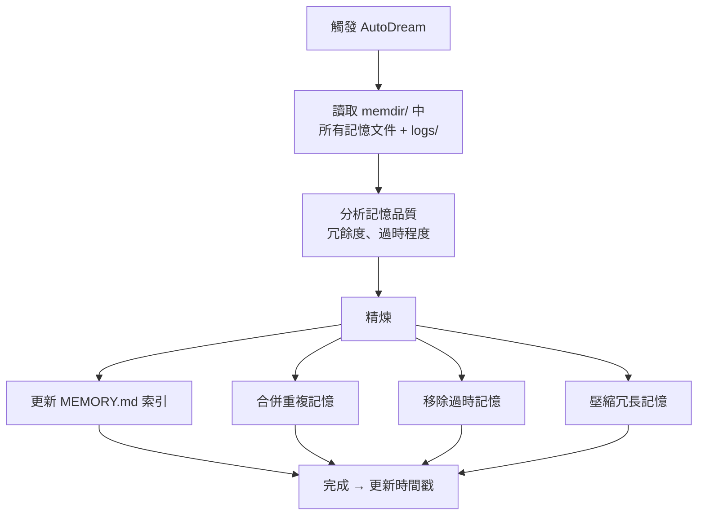

# AutoDream 夢境記憶整合

## 概述

AutoDream 是跨 session 的記憶鞏固機制，類比人類的「夢境整合」——在非活躍時期整理、精煉、去冗餘的記憶。

## 觸發條件

雙重門檻：
1. **時間門檻**：距上次整合 ≥ 24 小時
2. **Session 門檻**：已累積 ≥ 5 個 sessions

Feature flag `tengu_onyx_plover` 控制啟用和排程。

## 整合流程

## 工具權限

與 [[ExtractMemories 自動記憶提取|ExtractMemories]] 共享 `createAutoMemCanUseTool`：
- Read/Grep/Glob（無限制）
- 唯讀 Bash
- Write/Edit（限 memory 目錄）

## 失敗處理

> [!info] 回滾鎖的 mtime
> 失敗時回滾鎖的修改時間（mtime），讓時間門檻在下次繼續有效，而非浪費一次整合機會。

- 用戶中止 → DreamTask 已回滾，不重複
- 執行錯誤 → 記錄 debug log，下次重試

## 與 ExtractMemories 的分工

| 子系統 | 頻率 | 範圍 | 目標 |
|--------|------|------|------|
| **ExtractMemories** | 每輪對話 | 最近 N 條訊息 | 增量提取 |
| **AutoDream** | 每 24h + 5 sessions | 整個 memdir | 整合精煉 |

## 關聯筆記

- [[Memory 五大子系統架構]] — 在記憶體系中的位置
- [[Memdir 核心與 MEMORY.md]] — AutoDream 精煉的目標
- [[ExtractMemories 自動記憶提取]] — 互補的記憶系統
- [[Memory 設計原則集]] — 原則 10（失敗模式設計）

---

> [!tip] 導航
> 返回 [[Memory & Context MOC]] · [[Claude Code 逆向工程知識庫]]
