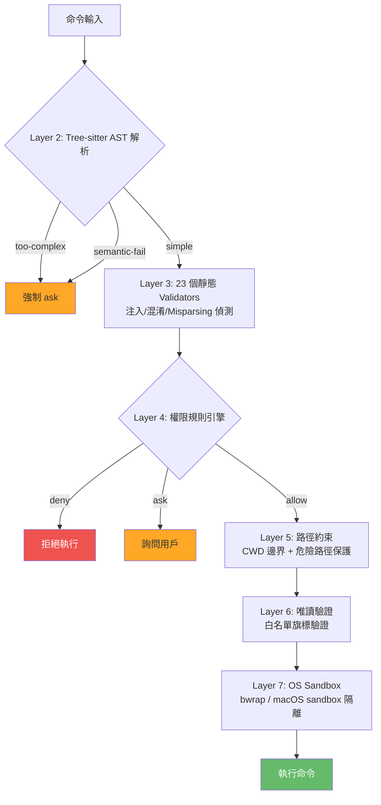
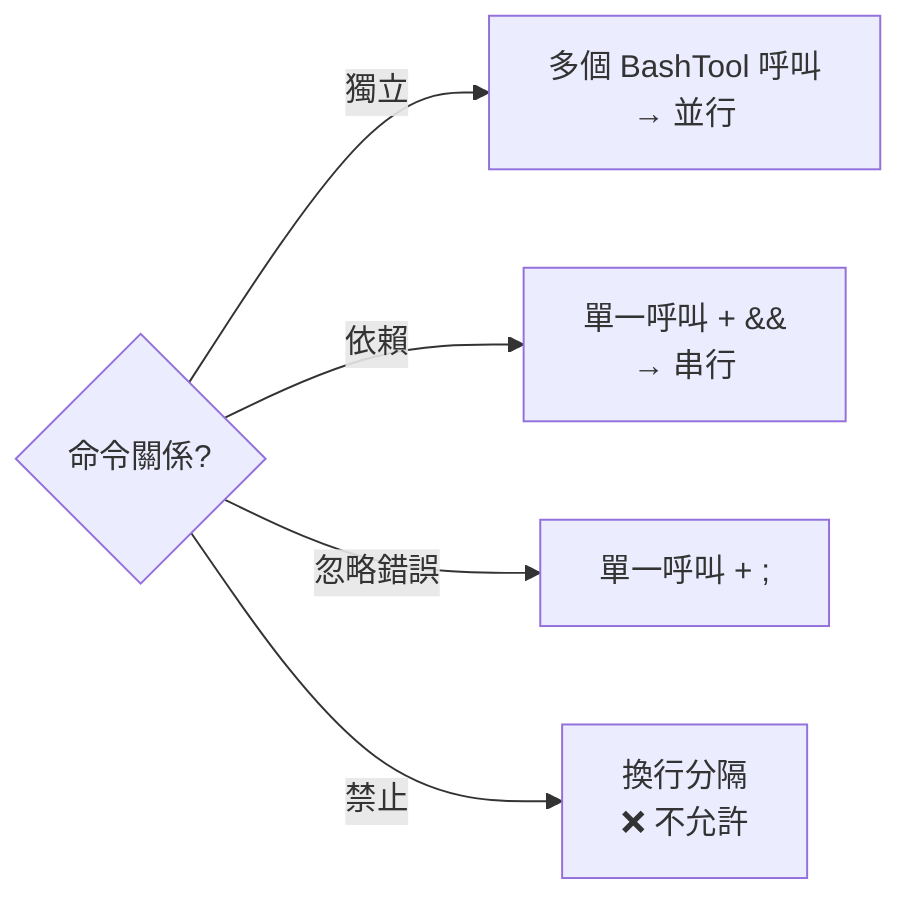

# BashTool 深度剖析

## 概述

BashTool 是 Claude Code 最強大也最危險的工具。它允許模型執行任意 shell 命令，因此配備了系統中最複雜的安全防護——5000+ 行的安全相關程式碼。

## Prompt 結構（369 行）

BashTool 的 prompt 包含多個專項指引：

| Section | 內容 |
|---------|------|
| **工具偏好** | 不要用 bash 做 find/grep/cat，用專用工具 |
| **並行指引** | `&&`（依賴）vs 多 tool call（獨立）vs `;`（忽略錯誤）|
| **Git Safety Protocol** | NEVER update git config、NEVER skip hooks |
| **Sandbox 指引** | sandbox 限制說明 + 失敗重試策略 |
| **Sleep 限制** | 不要用 sleep loop，診斷 root cause |

## 安全防護架構

BashTool 的安全檢查是 [[七層縱深防禦模型]] 中最核心的部分：



→ 詳見 [[七層縱深防禦模型]]、[[Bash 命令安全過濾與 AST 解析]]、[[權限規則引擎]]

## Tree-sitter AST 解析

使用 tree-sitter 將 bash 命令解析為 AST，比字串匹配更準確：

| 解析結果 | 含義 | 處理 |
|----------|------|------|
| `simple` | 乾淨命令 | 繼續後續檢查 |
| `too-complex` | 包含控制流、命令替換 | 強制 ask |
| `semantic-fail` | 危險命令（eval、builtins）| ask |

## Git Safety Protocol

```
- NEVER update the git config
- NEVER run destructive git commands unless explicitly requested
- NEVER skip hooks
- CRITICAL: Always create NEW commits rather than amending
- NEVER use `git add -A`（可能包含 .env 等敏感檔案）
```

## Sandbox 整合

```typescript
// 沙箱失敗時的自動重試
if (sandboxFailure) {
  // 立即重試 with dangerouslyDisableSandbox: true
  // 不需要詢問用戶
}
```

→ 詳見 [[Sandbox 沙箱隔離機制]]

## 並行執行策略



## 關聯筆記

- [[七層縱深防禦模型]] — BashTool 涵蓋所有 7 層
- [[Bash 命令安全過濾與 AST 解析]] — Layer 2-3 詳解
- [[權限規則引擎]] — Layer 4 詳解
- [[Sandbox 沙箱隔離機制]] — Layer 7 詳解
- [[Tool Prompt 設計模式集]] — 模式 1、7、8

---

> [!tip] 導航
> 返回 [[Tool System MOC]] · [[Security & Permissions MOC]] · [[Claude Code 逆向工程知識庫]]
