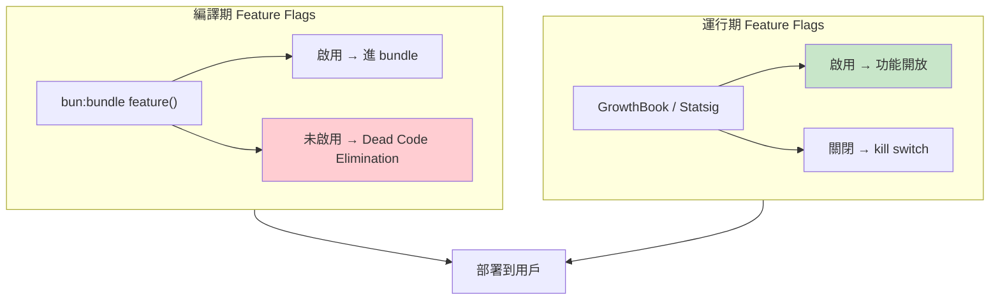

# Beta Features 與 Feature Flags 系統

## 概述

Claude Code 使用兩層 feature flag 系統控制功能的釋出和啟用。

## 兩層系統架構



## 兩層系統

### 編譯期 Feature Flags

```typescript
import { feature } from 'bun:bundle'

if (feature('COORDINATOR_MODE')) {
  // 這段程式碼在 build 時被靜態分析
  // 未啟用 → Dead Code Elimination → 完全不進 bundle
}
```

**特點**：
- Build 時決定，不可動態切換
- 未啟用的功能完全從 bundle 移除
- 安全（攻擊者無法啟用未 build 的功能）

### 運行期 Feature Flags

```typescript
// GrowthBook / Statsig
const isEnabled = await growthbook.isOn('tengu_session_memory')
```

**特點**：
- 即時 kill switch，不需重新部署
- 支援 A/B testing
- 所有 flag 以 `tengu_` 前綴命名

## 編譯期已知的重要 Flags

| Flag | 功能 |
|------|------|
| `COORDINATOR_MODE` | 多 Agent 協調 |
| `FORK_SUBAGENT` | Agent fork 語義 |
| `COMPUTER_USE` | 代號 Chicago — 電腦控制 |
| `KAIROS` | 主動模式 |
| `VOICE_MODE` | 語音互動 |
| `BUDDY` | AI 寵物 |
| `ULTRAPLAN` | 遠端 Opus 規劃 |
| `PLUGINS` | Plugin marketplace |
| `UDS_INBOX` | 跨 session 通訊 |

## 運行期已知的重要 Flags

| Flag | 功能 |
|------|------|
| `tengu_passport_quail` | ExtractMemories |
| `tengu_session_memory` | Session Memory |
| `tengu_herring_clock` | Team Memory |
| `tengu_onyx_plover` | AutoDream |
| `tengu_1h_cache_ttl` | 1 小時 cache TTL |
| `tengu_scratch` | Scratchpad 共享 |

→ 完整清單見 [[82 個未公開 Feature Flags]]

## Beta API Headers

```typescript
// API 請求中的 beta headers
const betaHeaders = ['prompt-caching-2024-07-31']

if (feature('COMPUTER_USE')) {
  betaHeaders.push('computer-use-2025-01-24')
}
```

Beta headers 影響 [[Prompt Cache 策略與 Break Detection|Prompt Cache]] — 變更 beta headers 會導致 cache break。

## 設計哲學

> [!info] 完整實作 + 控制釋出
> 功能完整實作後以 flag 隱藏，允許：
> - 內部測試（Anthropic 員工先啟用）
> - 漸進式釋出（百分比 rollout）
> - 即時回滾（kill switch）
> - A/B 測試效果

## 關聯筆記

- [[82 個未公開 Feature Flags]] — 完整清單
- [[Prompt Cache 策略與 Break Detection]] — Beta headers 對 cache 的影響
- [[Tool Prompt 設計模式集]] — 模式 5（Feature Flag 動態切換）
- [[模型配置與 Provider 支援]] — Beta 與模型能力的關係

---

> [!tip] 導航
> 返回 [[Cost Engineering MOC]] · [[Claude Code 逆向工程知識庫]]
