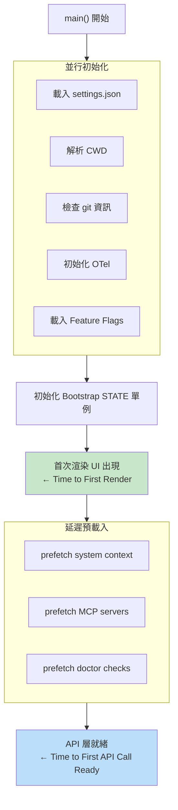
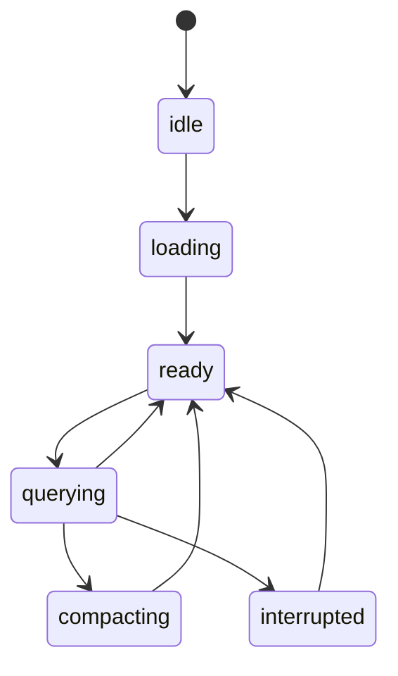

# Bootstrap 啟動流程與生命週期

## 設計目標

Bootstrap 的核心目標是最小化兩個關鍵指標：
1. **Time to First Render** — 用戶看到 UI 的時間
2. **Time to First API Call Ready** — 系統準備好接受第一次模型呼叫的時間

## 啟動計時器系統

系統使用精確的計時器追蹤每個啟動階段：

```typescript
type StartupTimers = {
  mainStartMs: number          // main() 開始
  mainFinishMs: number         // main() 完成
  renderStartMs: number        // 首次渲染開始
  firstPaintMs: number         // 首次繪製完成
  apiReadyMs: number           // API 準備完成
  firstTokenMs: number         // 首個 token 接收
}
```

## 啟動管道（並行優化）



## STATE 單例結構

`bootstrap/state.ts` 是整個系統的全域狀態容器：

```typescript
const STATE = {
  // Session 資訊
  sessionId: string
  conversationId: string
  cwd: string
  isGit: boolean

  // OTel 遙測
  meter: Meter | null
  tracerProvider: TracerProvider | null
  // ... (多個 counter)

  // 效能追蹤
  turnHookDurationMs: number
  turnToolDurationMs: number
  turnClassifierDurationMs: number

  // 錯誤日誌
  inMemoryErrorLog: Array<{ error: string; timestamp: string }>

  // API 追蹤
  lastAPIRequest: ...
  lastApiCompletionTimestamp: number | null
}
```

→ 詳見 [[Observability 三層可觀測性架構]]

## Session 生命週期狀態機



## 設定載入優先序

設定從多個來源載入，優先序從高到低：

1. **CLI 參數** — `--model`, `--system-prompt` 等
2. **環境變數** — `CLAUDE_CODE_*`
3. **Project settings** — `.claude/settings.json`（repo 層級）
4. **User settings** — `~/.claude/settings.json`（用戶層級）
5. **Policy settings** — MDM 管理的企業策略
6. **Flag settings** — GrowthBook/Statsig 遠端設定
7. **預設值** — 程式碼中的 defaults

## 啟動最佳化技巧

| 技巧 | 說明 |
|------|------|
| **Lazy Loading** | 非啟動必要的模組延遲載入 |
| **Deferred Prefetch** | 預載入但不阻塞主流程 |
| **並行初始化** | 無依賴的初始化步驟 Promise.all |
| **Session ID 快取** | 避免每次啟動重新生成 |
| **安全 CWD 解析** | 一次解析，全程使用 |

## Session ID 管理

```typescript
// 格式：uuid-v4
// 用途：
// 1. 遙測的 session 追蹤
// 2. 費用追蹤的歸屬
// 3. 記憶系統的 session 隔離
// 4. prompt cache 的 session 穩定性
```

## 關聯筆記

- [[Agent Loop 核心執行機制]] — Bootstrap 完成後進入的主迴圈
- [[Observability 三層可觀測性架構]] — STATE 中的遙測基礎設施
- [[Harness Engineering 12 原則]] — 原則 9（Bootstrap 狀態：State 必須表達啟動階段）

---

> [!tip] 導航
> 返回 [[Harness Engineering MOC]] · [[Claude Code 逆向工程知識庫]]
