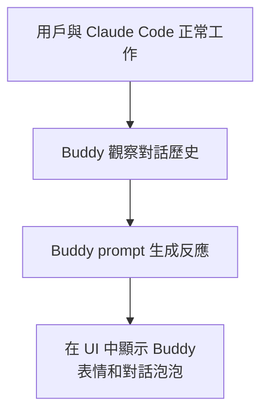

# Buddy AI 寵物系統

## 概述

Buddy 是 Claude Code 中一個獨特的 AI 伴侶系統。它在工作時陪伴用戶，以可愛的動物角色提供情感支持和輕鬆互動。

## 啟用方式

```typescript
if (feature('BUDDY')) {
  // 載入 Buddy 系統
}
```

## 系統設計

| 元素 | 說明 |
|------|------|
| **角色** | 可愛的動物（由用戶選擇或隨機）|
| **性格** | 有自己的情緒狀態和反應模式 |
| **互動** | 對工作進度做出反應（完成任務時開心、遇到錯誤時擔心）|
| **位置** | UI 中的獨立區域（side panel 或 status bar）|

## 工作流程



## Prompt 設計

Buddy 的 prompt 是一個完整的角色扮演指令：
- 指定動物類型和名字
- 定義性格特質
- 設定情緒反應規則
- 限制回應長度（簡短可愛）

## 設計哲學

> [!info] 工程師的情感需求
> 長時間獨自 coding 可能孤獨。Buddy 的存在提供了一種輕鬆的陪伴感，同時不干擾工作流程。它是 Claude Code 中最「人性化」的功能。

## 關聯筆記

- [[82 個未公開 Feature Flags]] — `BUDDY` flag
- [[輔助 Prompt 子系統]] — Buddy 的 prompt

---

> [!tip] 導航
> 返回 [[Claude Code 逆向工程知識庫]]
