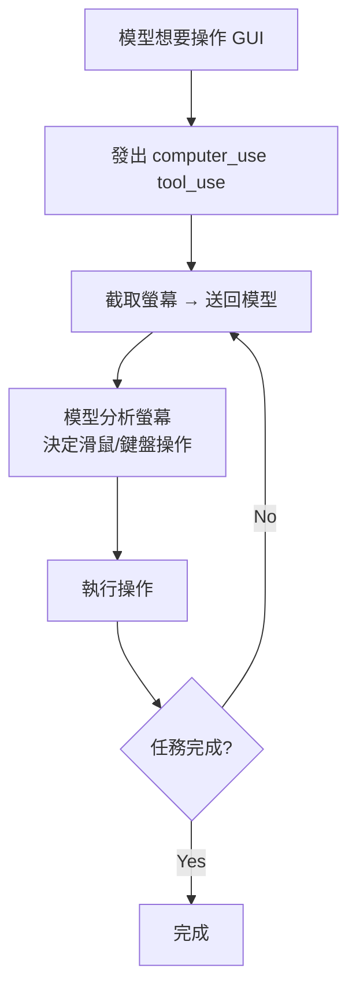

# Computer Use 電腦控制整合

## 概述

Computer Use（代號 Chicago）允許 Claude Code 直接控制 macOS 的滑鼠、鍵盤和螢幕截圖，實現 GUI 層級的電腦操作。

## 啟用方式

```typescript
if (feature('COMPUTER_USE')) {
  // 載入 Computer Use 工具
  // 需要 beta header: 'computer-use-2025-01-24'
}
```

## 能力

| 操作 | 說明 |
|------|------|
| **螢幕截圖** | 擷取當前螢幕畫面 |
| **滑鼠點擊** | 指定座標點擊 |
| **滑鼠移動** | 移動到指定座標 |
| **鍵盤輸入** | 輸入文字或快捷鍵 |
| **拖曳** | 拖放操作 |
| **捲動** | 上下捲動 |

## 工作流程



## 安全限制

- 只在 macOS 上支援
- 需要 Accessibility 權限
- 操作全螢幕可見（用戶可隨時看到和中斷）
- 透過 [[七層縱深防禦模型|權限系統]] 控制

## 關聯筆記

- [[82 個未公開 Feature Flags]] — `COMPUTER_USE` flag
- [[Beta Features 與 Feature Flags 系統]] — Beta API header
- [[36 工具系統總覽]] — Computer Use 工具

---

> [!tip] 導航
> 返回 [[Claude Code 逆向工程知識庫]]
