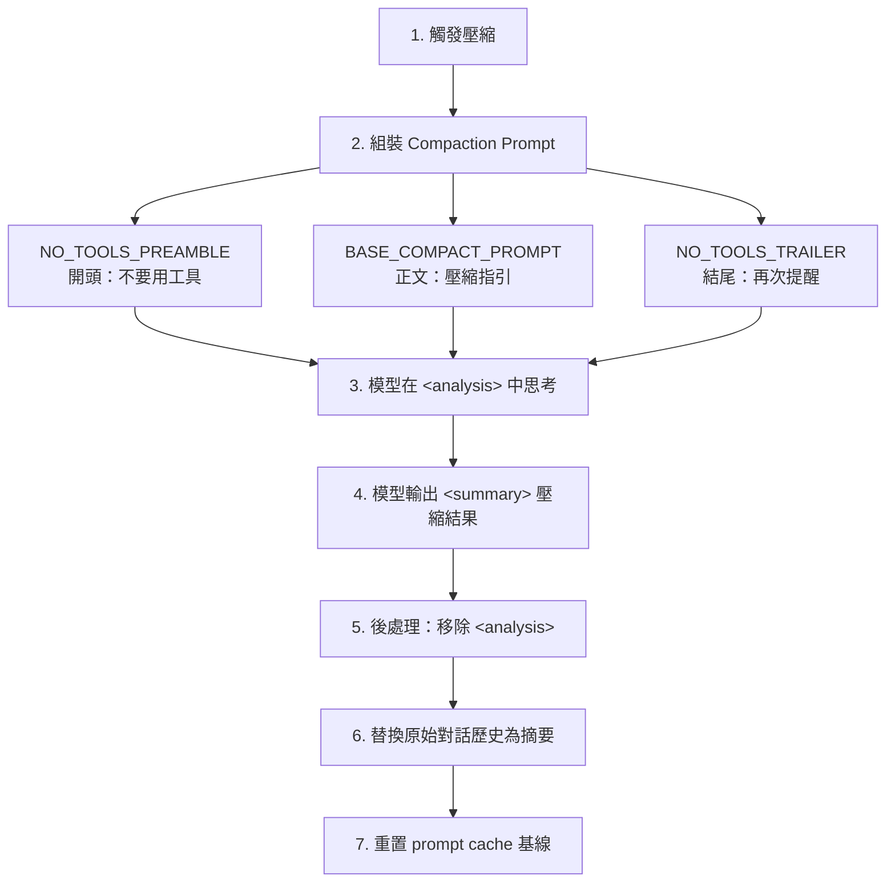

# Context Compaction 壓縮策略

## 觸發時機

當對話歷史接近 context window 上限時，自動觸發壓縮。系統監控 token 使用量，在達到閾值時啟動 compaction 流程。

## 壓縮流程



## 三明治強化（Sandwich Reinforcement）

Compaction Prompt 使用「三明治」結構強化「不要使用工具」的指令：

```typescript
// 前置強調
const NO_TOOLS_PREAMBLE = `CRITICAL: Respond with TEXT ONLY. Do NOT call any tools.
- Tool calls will be REJECTED and will waste your only turn — you will fail the task.`

// 後置強調
const NO_TOOLS_TRAILER = '\n\nREMINDER: Do NOT call any tools...'

// 組裝
let prompt = NO_TOOLS_PREAMBLE + BASE_COMPACT_PROMPT + NO_TOOLS_TRAILER
```

> [!info] 效果
> 從 2.79% 工具呼叫失效率優化到接近 0%。

→ 詳見 [[Prompt Engineering 設計模式集]] 模式 1（三明治強化）

## Chain-of-Thought 草稿空間

```typescript
// 模型在 <analysis> 中思考（不保留在最終結果）
const DETAILED_ANALYSIS_INSTRUCTION = `Before providing your final summary,
wrap your analysis in <analysis> tags to organize your thoughts...`

// 後處理移除草稿
formattedSummary = formattedSummary.replace(/<analysis>[\s\S]*?<\/analysis>/, '')
```

→ 詳見 [[Prompt Engineering 設計模式集]] 模式 3（Scratchpad Pattern）

## 壓縮策略類型

| 策略 | 觸發 | 保留內容 |
|------|------|---------|
| **base** | 首次壓縮 | 完整摘要 |
| **partial** | 對話繼續增長 | 保留最近 N 條訊息 + 摘要前段 |
| **partial_up_to** | 指定訊息 ID | 壓縮到指定位置 |

## 壓縮品質保證

Compaction Prompt 要求模型保留：
1. 所有檔案修改的具體路徑和內容
2. 決策的理由和上下文
3. 尚未完成的任務狀態
4. 用戶明確表達的偏好

## 與其他子系統的互動

- **Prompt Cache**：壓縮後重置 cache 基線（`notifyCompaction()`），避免誤報 cache break
- **Session Memory**：壓縮前可能觸發 [[Session Memory 即時快照]] 保存更詳細的筆記
- **ExtractMemories**：壓縮不影響已提取的記憶

→ 詳見 [[Prompt Cache 策略與 Break Detection]]

## 關聯筆記

- [[Context Engineering 多層管道]] — Compaction 是 Context 管理的最後一道防線
- [[Agent Loop 核心執行機制]] — 壓縮後 Agent Loop 繼續運作
- [[Memory 五大子系統架構]] — Session Memory 與 Compaction 的互補
- [[Prompt Engineering 設計模式集]] — 模式 1、3 的具體應用

---

> [!tip] 導航
> 返回 [[Prompt Engineering MOC]] · [[Claude Code 逆向工程知識庫]]
