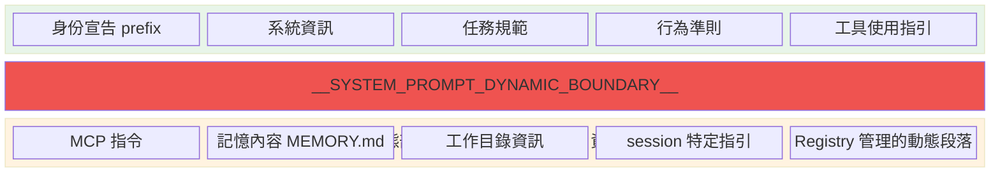
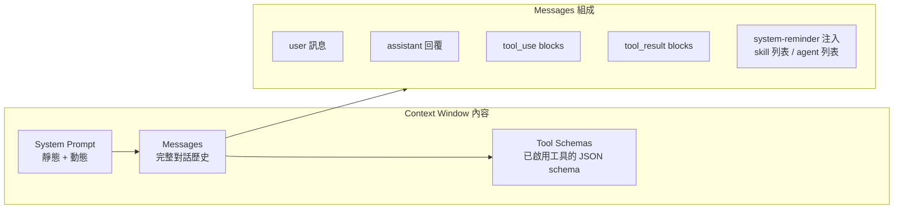

# Context Engineering 多層管道

## 核心理念

> [!important] Context > Prompt
> 「讓模型看到什麼」比「如何跟模型說話」更決定系統性能。Context Engineering 是 [[Harness Engineering 定義與公式|Harness Engineering]] 中最關鍵的 Knowledge 層面。

## 六大管道

### 1. System Prompt 組裝

System Prompt 由靜態 + 動態兩部分組裝：

→ 詳見 [[System Prompt 動態組裝邏輯]]

### 2. Messages 正規化管道

每次 API 呼叫前，messages 經過完整的正規化流程：

1. **合併相鄰 user/assistant 訊息** — API 要求 role 交替
2. **Cache breakpoint 插入** — 在戰略位置標記 `cache_control`
3. **圖片移除**（非 vision 模型）
4. **Extended thinking 格式轉換**
5. **Token 預算檢查與截斷**

### 3. Prompt Cache 設計

兩層緩存策略：

| 機制 | 說明 | 效果 |
|------|------|------|
| **Sticky Latch** | 靜態部分用 `scope: 'global'` 緩存 | 跨用戶共享，命中率 ~100% |
| **Cache Breakpoints** | 在 system prompt 末尾和對話歷史中插入 cache markers | 增量寫入，最大化複用 |
| **Dynamic Boundary** | `__SYSTEM_PROMPT_DYNAMIC_BOUNDARY__` 分隔靜態/動態 | 防止動態內容破壞全局緩存 |

→ 詳見 [[Prompt Cache 策略與 Break Detection]]、[[Cache 穩定性工程模式]]

### 4. Context Window 內容

模型每次 API 呼叫看到的完整內容：

### 5. Context Compaction

當 context 接近上限時，觸發壓縮：

1. 調用 compaction prompt（帶 `<analysis>` 草稿空間）
2. 生成對話摘要（保留 `
` 部分）
3. 替換原始對話歷史為摘要
4. 重置 cache 基線

→ 詳見 [[Context Compaction 壓縮策略]]

### 6. Tool Search（延遲載入）

並非所有 36 個工具的 schema 一開始就在 context window 中：

- 核心工具始終載入
- 冷門工具（如 Computer Use、某些 MCP 工具）在模型需要時動態搜尋載入
- 節省常態下的 context 空間

## 設計原則

> [!info] N 個 boolean 條件的 Cache 影響
> 如果有 10 個 boolean 條件放在靜態部分 → 2^10 = 1024 個不同的 prompt hash → cache 幾乎不會 hit。
> 移到動態邊界之後 → 靜態部分只有 1 個 hash → hit rate 接近 100%。

## 關聯筆記

- [[System Prompt 動態組裝邏輯]] — Context 管道的第一步
- [[Prompt Cache 策略與 Break Detection]] — 緩存效率的關鍵
- [[Context Compaction 壓縮策略]] — 長對話的 context 管理
- [[Agent Loop 核心執行機制]] — Context 準備後進入的執行階段
- [[Prompt Engineering 設計模式集]] — 模式 6（Boundary Marker）、模式 9（條件注入維度分離）

---

> [!tip] 導航
> 返回 [[Harness Engineering MOC]] · [[Claude Code 逆向工程知識庫]]
