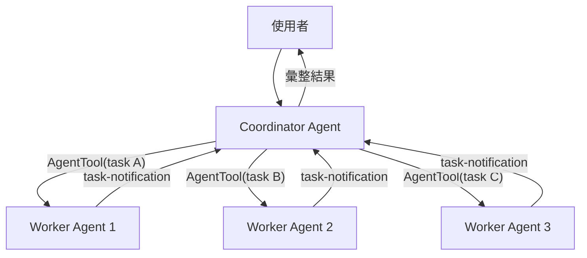

# Coordinator Mode 多 Agent 協調

## 概述

Coordinator Mode 是 Claude Code 的多 Agent 協調系統。啟用後，主 agent 轉變為「協調者」角色，不再直接執行工具，而是將任務分解並派遣給 worker agents。

## 啟用方式

```bash
CLAUDE_CODE_COORDINATOR_MODE=1
```

或透過 feature flag 自動啟用。

## 架構



## Coordinator 的 System Prompt

Coordinator 的 system prompt 明確定義了角色和規則：

1. **角色**：你是一個 coordinator，負責將任務分解為子任務
2. **工具限制**：只能使用 AgentTool、SendMessageTool、TaskStopTool
3. **工作流程**：分析 → 分解 → 派遣 → 等待 → 彙整
4. **並行要求**：盡可能並行派遣獨立任務

## Worker Agent 機制

### 派遣方式

透過 [[AgentTool 與 Subagent 派遣|AgentTool]] 派遣 worker：

```
AgentTool({
  task: "具體任務描述",
  run_in_background: true,  // 背景執行
  subagent_type: "general-purpose"
})
```

### 結果回報格式

Worker 完成後以 `<task-notification>` XML 格式回報：

```xml
<task-notification>
Agent general-purpose completed task: "實作登入功能"
Result: 已建立 login.tsx 和 auth.ts，通過所有測試
</task-notification>
```

### Continue vs Spawn 決策

| 情境 | 策略 | 理由 |
|------|------|------|
| 新的獨立任務 | **Spawn** 新 worker | 不消耗既有 context |
| 需要修正 worker 結果 | **Continue** 同一 worker | 保留 context 和狀態 |
| 需要追加相關工作 | **Continue** | 效率更高 |

## 與 Swarm 系統的區別

| 特性 | Coordinator Mode | Swarm/Team 系統 |
|------|-----------------|----------------|
| 觸發方式 | 環境變數/flag | TeamCreate 工具 |
| 通訊方式 | AgentTool 回傳 | Mailbox 信箱系統 |
| 隔離方式 | 同進程 subagent | tmux pane / in-process |
| 複雜度 | 較低 | 較高（含權限同步） |
| 適用場景 | 任務分解 | 長期團隊協作 |

→ 詳見 [[Swarm 與 Teammate 多 Agent 協作]]

## Session Resume 對齊

如果用戶重新進入一個已有 coordinator mode 的 session，系統會自動對齊：
- 檢測歷史 messages 中是否有 coordinator 模式的痕跡
- 自動重新啟用 coordinator system prompt
- 保持一致的行為

## Anti-Patterns

> [!warning] 避免的模式
> - **過度分解**：簡單任務不需要 coordinator → 直接執行
> - **序列化**：獨立子任務必須並行派遣，不可逐一序列化
> - **Coordinator 自己動手**：coordinator 不應使用 Bash/Edit 等工具

## 關聯筆記

- [[Agent 系統三層架構]] — Coordinator 是最上層的 Agent 模式
- [[AgentTool 與 Subagent 派遣]] — 派遣 worker 的工具
- [[Agent 生命週期]] — Worker 的 spawn → execute → return 流程
- [[Swarm 與 Teammate 多 Agent 協作]] — 更複雜的多 Agent 系統
- [[Agent 間通訊機制]] — 各種 Agent 間的通訊方式

---

> [!tip] 導航
> 返回 [[Harness Engineering MOC]] · [[Agent Architecture MOC]] · [[Claude Code 逆向工程知識庫]]
