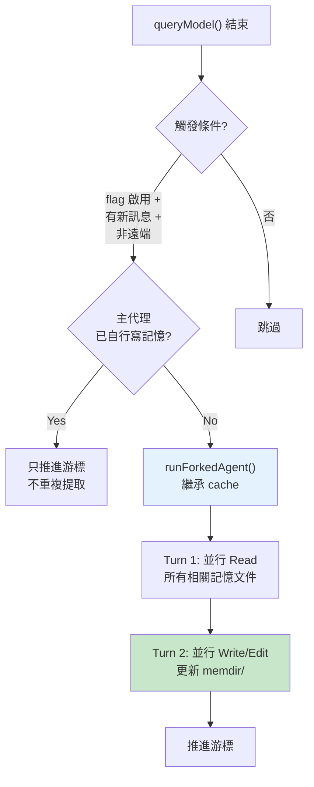

# ExtractMemories 自動記憶提取

## 概述

ExtractMemories 是一個背景 forked agent，在每輪對話結束後自動分析新訊息，提取值得跨 session 記憶的資訊並寫入 [[Memdir 核心與 MEMORY.md|Memdir]]。

## 執行流程



## 觸發條件

- 每輪 `queryModel()` 結束後
- 有足夠的新訊息（cursor 機制）
- Feature flag `tengu_passport_quail` 啟用
- 非遠端模式

## Cursor 機制（增量處理）

```typescript
let lastMemoryMessageUuid: string | undefined  // 游標

function countModelVisibleMessagesSince(messages, sinceUuid): number {
  // 只計算游標之後的新訊息
}
```

- 不每次重新分析整個對話歷史
- 維護游標，只處理上次提取之後的新訊息
- O(new messages) 而非 O(total messages)

→ 詳見 [[Memory 設計原則集]] 原則 4

## 與主代理互斥

```typescript
if (hasMemoryWritesSince(messages, lastMemoryMessageUuid)) {
  // 主代理已自己寫記憶 → 跳過背景提取，只推進游標
  return
}
```

> [!info] 誰先寫誰優先
> 主代理的 prompt 包含完整的記憶保存指令。若主代理主動寫記憶，背景提取是冗餘的。「誰先寫誰優先，另一方退出」防止雙重寫入。

→ 詳見 [[Memory 設計原則集]] 原則 5

## Prompt 設計

```
角色：你是 Claude Code 的記憶提取子系統
限制：最多 5 turns
工具：Read/Grep/Glob（無限制）+ 唯讀 Bash + Write/Edit（限 memory 目錄）
```

### 嚴格的效率要求

```
You MUST only use content from the last ~N messages.
Do not waste any turns attempting to investigate or verify that content further
— no grepping source files, no reading code to confirm a pattern exists, no git commands.
```

高效路徑指引：
```
Turn 1 — 全部 Read（並行讀取所有可能更新的文件）
Turn 2 — 全部 Write/Edit（並行寫入）
```

→ 詳見 [[Prompt Engineering 設計模式集]] 模式 5（效率策略預設）

## 失敗處理

- 提取失敗 → 記 debug log，不通知用戶
- 游標不前進 → 下次包含失敗的訊息重試
- 遠端模式 → 不執行

## Prompt Cache 共享

使用 `runForkedAgent()` 繼承父對話的 system prompt：

```typescript
const cacheSafeParams = createCacheSafeParams(context)
const result = await runForkedAgent({ cacheSafeParams, ... })
```

高 cache hit 率是背景子系統保持低成本的關鍵。

→ 詳見 [[Memory 設計原則集]] 原則 7

## 節流機制

Feature flag `tengu_bramble_lintel` 控制提取間隔，防止在快速對話中頻繁觸發。

## 關聯筆記

- [[Memory 五大子系統架構]] — 在記憶體系中的位置
- [[Memdir 核心與 MEMORY.md]] — 提取結果的存儲目標
- [[Memory 設計原則集]] — 原則 1、4、5、7、8
- [[輔助 Prompt 子系統]] — ExtractMemories 的 prompt

---

> [!tip] 導航
> 返回 [[Memory & Context MOC]] · [[Claude Code 逆向工程知識庫]]
