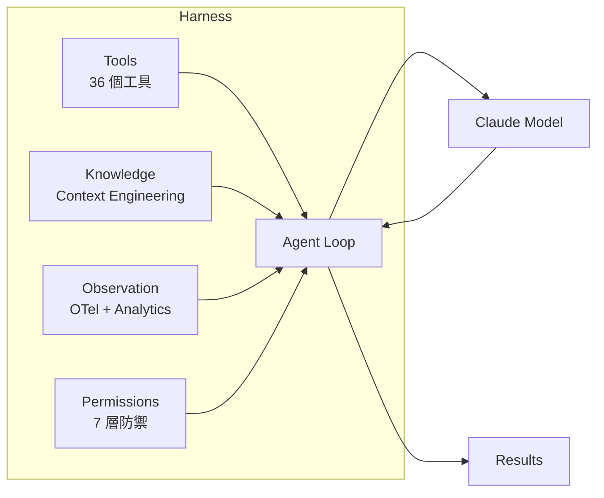

# Harness Engineering 定義與公式

## 核心定義

**Harness Engineering** 是一門新興的工程學科，專注於設計和建構 LLM Agent 的「馬具」——即包圍在語言模型周圍，讓它能有效、安全、可靠地與外部世界互動的所有基礎設施。

> [!important] Harness 公式
> **Harness = Tools + Knowledge + Observation + Action Interfaces + Permissions**
>
> — 出自 Anthropic 工程團隊 [Effective Harnesses for Long-Running Agents](https://www.anthropic.com/engineering/effective-harnesses-for-long-running-agents)

## 五大組成要素

| 要素 | Claude Code 對應 | 說明 |
|------|-----------------|------|
| **Tools** | [[36 工具完整索引表\|36 個工具]] | 模型與外部世界互動的原子能力 |
| **Knowledge** | [[Context Engineering 多層管道]] | 系統提供給模型的知識（system prompt、memory、context） |
| **Observation** | [[Observability 三層可觀測性架構]] | 監控和追蹤 agent 行為的遙測系統 |
| **Action Interfaces** | [[Agent Loop 核心執行機制]] | Agent 決策 → 執行的轉換層 |
| **Permissions** | [[七層縱深防禦模型]] | 控制 agent 能做什麼、不能做什麼的安全邊界 |

## 為什麼叫「Harness」？

類比馬具（harness）：
- 馬 = LLM（原始力量）
- 馬具 = Harness（引導和控制的工程基礎設施）
- 馬車 = Agent 系統（產出價值的完整系統）

馬具不是馬的一部分，但沒有馬具，馬無法有效地完成拉車的工作。同理，Harness 不是 LLM 模型本身，但沒有 Harness，LLM 無法成為有效的 Agent。

## Claude Code 作為 Harness 的範例

Claude Code 是目前最完整的生產級 LLM Harness 實作之一：

## 12 條可遷移設計原則

從 Claude Code 原始碼提煉的 12 條 Harness Engineering 設計原則：

→ 詳見 [[Harness Engineering 12 原則]]

## 與相關概念的關係

- **Prompt Engineering** 是 Harness Engineering 的子集（Knowledge 層面）→ [[Prompt Engineering 設計模式集]]
- **Tool Orchestration** 是 Harness 的 Tools + Action Interfaces → [[Tool Orchestration 調度系統]]
- **Security** 是 Harness 的 Permissions 層面 → [[Security 設計模式集]]
- **Context Engineering** 是 Harness 最關鍵的 Knowledge 層面 → [[Context Engineering 多層管道]]

---

> [!tip] 導航
> 返回 [[Harness Engineering MOC]] · [[Claude Code 逆向工程知識庫]]
