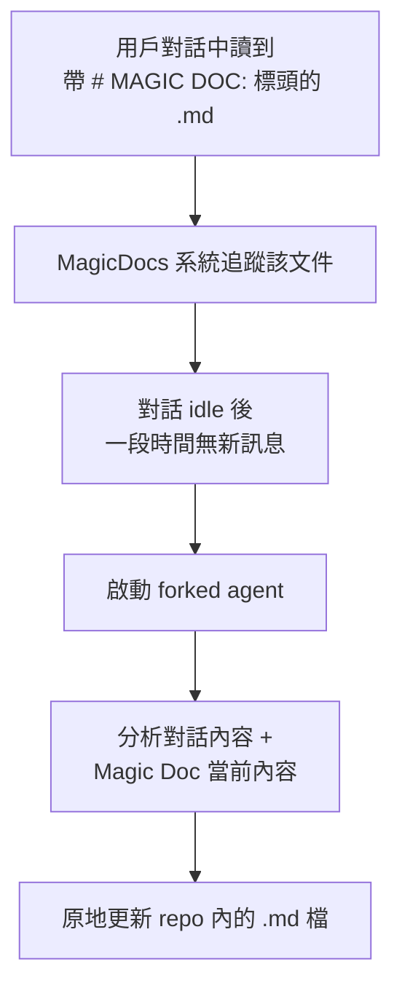

# MagicDocs 動態文件系統

## 概述

MagicDocs 是一個在對話 idle 後自動更新 repo 中特定 Markdown 文件的子系統。任何帶有 `# MAGIC DOC:` 標頭的 `.md` 檔都會被追蹤和維護。

## 運作機制

## 觸發條件

- 對話中模型讀取到 Magic Doc
- 對話進入 idle 狀態（用戶一段時間無新輸入）

## 工具權限

只允許 Edit 被追蹤的 Magic Doc 文件（最小權限原則）。

## 使用場景

- 自動維護 API 文件
- 自動更新架構圖文件
- 自動更新 README 中的特定段落
- 任何需要隨程式碼變更同步更新的文件

## 與其他記憶子系統的區別

| 特性 | MagicDocs | ExtractMemories | Session Memory |
|------|-----------|----------------|----------------|
| 存儲位置 | **repo 內** | memdir | session-memory/ |
| 觸發 | idle 後 | 每輪結束 | context 達門檻 |
| 目標 | 維護既有文件 | 提取新記憶 | 保存 session 快照 |
| 可見性 | **版本控制** | 私人 | 私人 |

> [!info] 版本控制友善
> MagicDocs 更新的文件在 repo 中，可以被 git 追蹤，讓團隊看到 AI 自動維護的文件變更。

## 關聯筆記

- [[Memory 五大子系統架構]] — 在記憶體系中的位置
- [[輔助 Prompt 子系統]] — MagicDocs 的 prompt
- [[Memory 設計原則集]] — 原則 6（工具權限最小化）

---

> [!tip] 導航
> 返回 [[Memory & Context MOC]] · [[Claude Code 逆向工程知識庫]]
