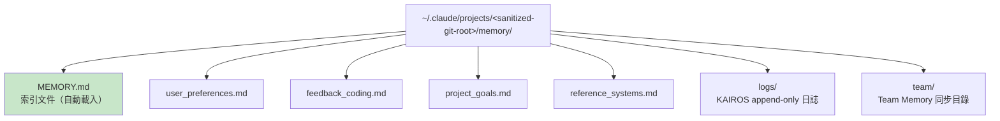
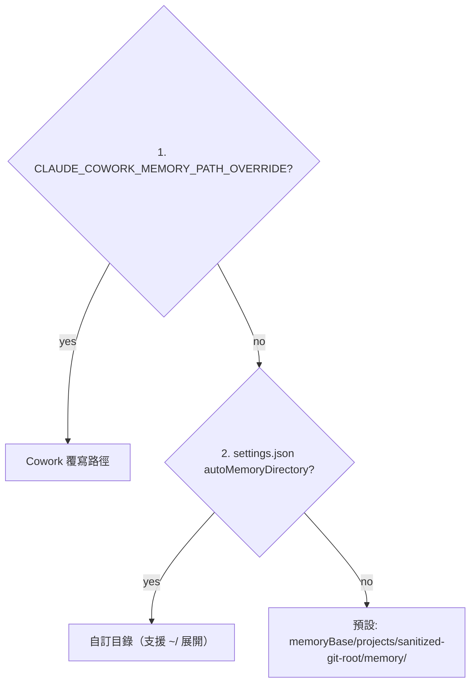

# Memdir 核心與 MEMORY.md

## 概述

Memdir（Memory Directory）是 Claude Code 永久記憶的核心。它是一個基於檔案系統的記憶存儲，`MEMORY.md` 作為索引文件在每次 session 啟動時自動載入到 system prompt。

## 目錄結構



## 路徑解析優先鏈



`memoryBase` 優先順序：
1. `CLAUDE_CODE_REMOTE_MEMORY_DIR` 環境變數
2. `~/.claude`

## MEMORY.md 的角色

MEMORY.md 是索引而非完整記憶：
- 每次 session 啟動時注入 system prompt
- 包含各記憶文件的摘要和指向
- 有容量限制（超限 → 截斷 + 警告）

> [!warning] 截斷而非拒絕
> MEMORY.md 超限時截斷並附加警告，不拒絕載入。模型看到警告後知道索引不完整，可決定是否整理。

## 記憶文件命名慣例

| 前綴 | 對應類型 | 範例 |
|------|---------|------|
| `user_` | user 類型 | `user_preferences.md` |
| `feedback_` | feedback 類型 | `feedback_testing.md` |
| `project_` | project 類型 | `project_auth_migration.md` |
| `reference_` | reference 類型 | `reference_monitoring.md` |

## 路徑安全驗證

所有路徑解析都經過安全驗證：
- 防止 null bytes
- 防止路徑穿越（`../`）
- 防止 UNC paths
- 防止 Windows drive roots

## DIR_EXISTS_GUIDANCE

```typescript
'This directory already exists — write to it directly with the Write tool
(do not run mkdir or check for its existence).'
```

明確告訴模型目錄已存在，不要浪費 turn 在確認環境上。

→ 詳見 [[Memory 設計原則集]] 原則 8

## 關聯筆記

- [[Memory 五大子系統架構]] — Memdir 在整體架構中的位置
- [[ExtractMemories 自動記憶提取]] — 寫入 Memdir 的子系統
- [[AutoDream 夢境記憶整合]] — 精煉 MEMORY.md 的子系統
- [[Memory 設計原則集]] — 記憶系統的設計原則

---

> [!tip] 導航
> 返回 [[Memory & Context MOC]] · [[Claude Code 逆向工程知識庫]]
