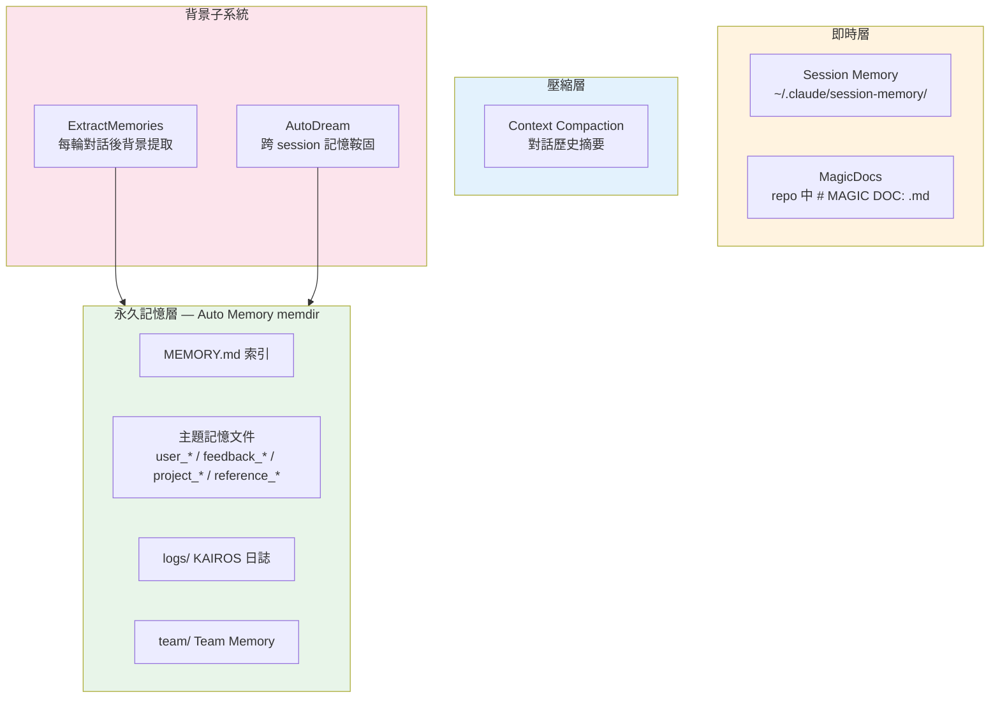
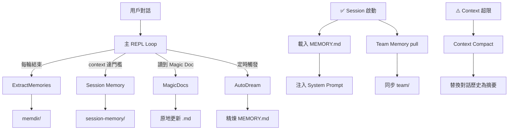

# Memory 五大子系統架構

## 概述

Claude Code 的 Memory 系統是一個多層次、多機制並存的持久化記憶架構。核心設計目標是讓模型能跨 session 記住使用者偏好、專案脈絡與回饋，同時維持可靠性、安全性與資源效率。

## 系統層次結構

## 各子系統職責

| 子系統 | 觸發時機 | 作用 | 詳細筆記 |
|--------|---------|------|---------|
| **Auto Memory** | session 啟動 / 模型寫入 | 跨 session 永久記憶 | [[Memdir 核心與 MEMORY.md]] |
| **ExtractMemories** | 每輪 query 結束 | 背景自動提取記憶 | [[ExtractMemories 自動記憶提取]] |
| **Session Memory** | context 達門檻 | 當前 session 快照筆記 | [[Session Memory 即時快照]] |
| **MagicDocs** | 對話 idle 後 | 自動維護特定文件 | [[MagicDocs 動態文件系統]] |
| **Team Memory** | session 啟動 / 文件變更 | 跨用戶團隊共享記憶 | [[Team Memory 跨用戶共享]] |
| **AutoDream** | 定期 (24h + 5 sessions) | 跨 session 記憶整合 | [[AutoDream 夢境記憶整合]] |
| **Context Compact** | context 接近上限 | 壓縮對話歷史 | [[Context Compaction 壓縮策略]] |

## 記憶類型分類

系統定義了四種封閉類型：

| 類型 | 說明 | 用途 |
|------|------|------|
| `user` | 使用者角色、目標、知識背景 | 調整溝通方式 |
| `feedback` | 指導原則（錯誤修正 + 成功確認）| 防止重蹈覆轍 + 強化有效方式 |
| `project` | 專案進行中的目標、決策、事件 | 理解動機和優先序 |
| `reference` | 外部系統指標（Linear、Grafana）| 知道去哪找資訊 |

> [!info] feedback 同時記錄正反面
> `feedback` 同時記錄失敗（「不要這樣做」）和成功（「繼續這樣做」）。若只記錄糾正，模型會避免已知錯誤但逐漸偏離已確認有效的方式。

## 明確禁止記憶的資訊

- 可從程式碼推導的架構、慣例
- git 歷史、誰改了什麼
- 已在 CLAUDE.md 記錄的事項
- 臨時任務狀態、當前 session 上下文

## 資料流向

## Feature Flag 控制

| Flag | 控制對象 |
|------|---------|
| `tengu_passport_quail` | ExtractMemories |
| `tengu_session_memory` | Session Memory |
| `tengu_herring_clock` | Team Memory |
| `tengu_onyx_plover` | AutoDream + 排程 |

→ 詳見 [[82 個未公開 Feature Flags]]

## 關聯筆記

- [[Memory 設計原則集]] — 12 條記憶系統設計原則
- [[輔助 Prompt 子系統]] — 記憶子系統的 prompt 設計
- [[Context Engineering 多層管道]] — 記憶是 Context 的重要來源

---

> [!tip] 導航
> 返回 [[Memory & Context MOC]] · [[Claude Code 逆向工程知識庫]]
