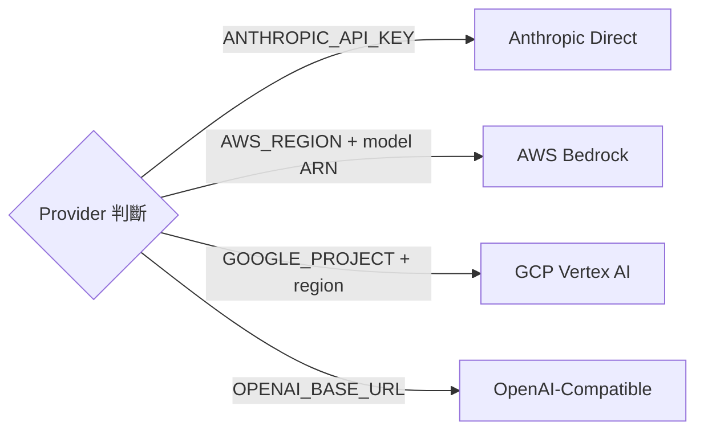

# Model Selection 與成本路由

## 概述

Claude Code 根據任務類型和成本考量，動態選擇不同的模型。這是一種「成本路由」策略——用最低成本的模型完成任務。

## 模型選擇策略

| 場景 | 模型 | 理由 |
|------|------|------|
| **主 agent** | Sonnet（預設）| 平衡能力與成本 |
| **Explore agent** | Haiku | 唯讀探索，不需高能力 |
| **Claude-Code-Guide** | Haiku | 文件查詢，快速回答 |
| **Statusline Setup** | Sonnet | 需要理解 terminal 設定 |
| **UltraPlan** | Opus（遠端）| 需要最高推理能力 |
| **AgentSummary** | Haiku / Sonnet | 短摘要生成 |
| **Compaction** | 繼承主 agent | 需要理解完整對話 |

## 成本路由原則

> [!info] 用最便宜的能勝任的模型
> - 唯讀操作 → Haiku（最便宜）
> - 一般操作 → Sonnet（平衡）
> - 複雜推理 → Opus（最貴但最強）

## 模型配置系統

`src/utils/model/` 包含 16 個檔案管理模型配置：

```typescript
type ModelConfig = {
  name: string              // 模型名稱
  contextWindow: number     // Context window 大小
  maxTokens: number         // 最大輸出 token
  inputPrice: number        // $/million tokens
  outputPrice: number       // $/million tokens
  cacheReadPrice: number    // $/million tokens
  cacheWritePrice: number   // $/million tokens
  supportsExtendedThinking: boolean
  supportsBetaFeatures: string[]
}
```

## 多 Provider 支援

| Provider | 機制 | 適用場景 |
|----------|------|---------|
| **Anthropic Direct** | 直接 API | 預設 |
| **AWS Bedrock** | Cross-region routing | 企業/合規 |
| **GCP Vertex AI** | Region-based | 企業/合規 |
| **OpenAI-Compatible** | 通用介面 | 自建/第三方 |



## 成本設計模式

### 1. Cache-First 設計
所有架構決策都以「最大化 prompt cache hit」為優先。

### 2. 最小模型原則
子任務使用能勝任的最小（最便宜）模型。

### 3. Token 預算感知
工具 prompt 的長度考量避免不必要的 context 消耗。

→ 詳見 [[Tool Prompt 設計模式集]] 模式 10

## 關聯筆記

- [[成本追蹤架構]] — 成本計算
- [[Prompt Cache 策略與 Break Detection]] — Cache 最佳化
- [[6 Built-in Agents 索引]] — 各 agent 的模型選擇
- [[模型配置與 Provider 支援]] — 技術實作細節

---

> [!tip] 導航
> 返回 [[Cost Engineering MOC]] · [[Claude Code 逆向工程知識庫]]
