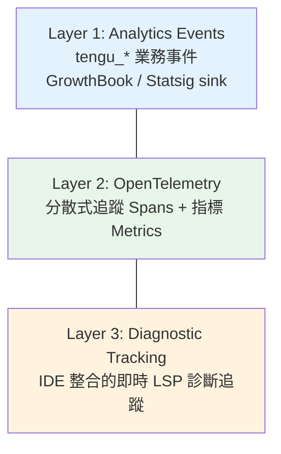
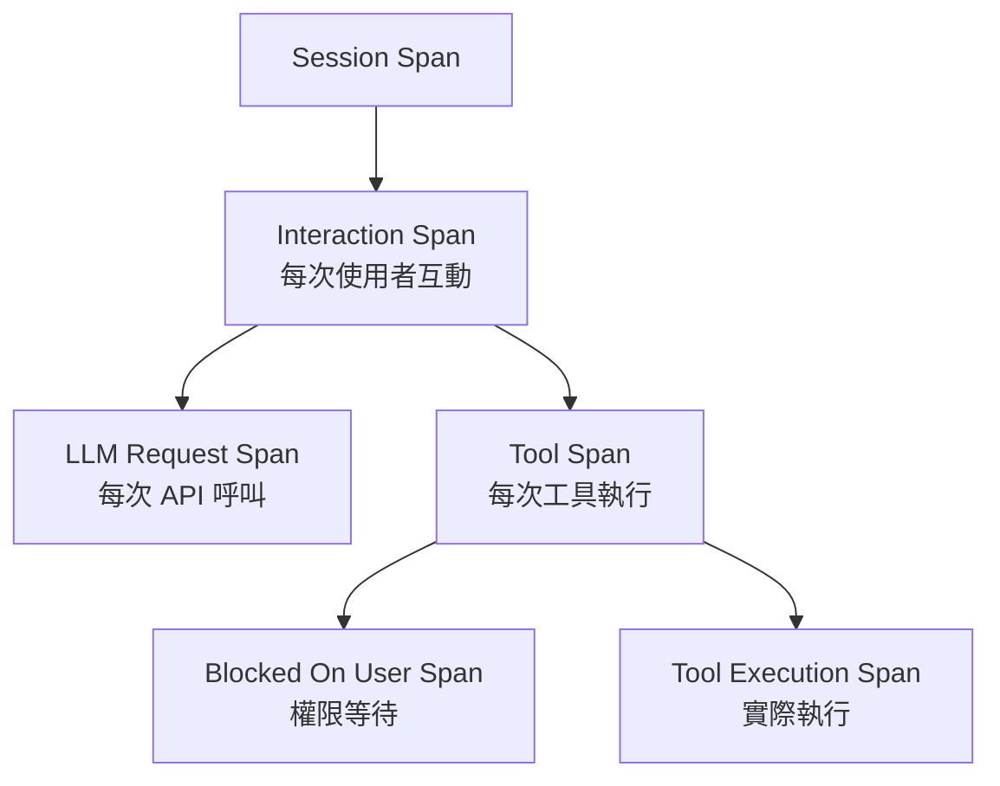

# Observability 三層可觀測性架構

## 三層架構



## Layer 1: Analytics Events

所有事件使用 `tengu_` 前綴（Claude Code 內部代號）。

| 事件 | 觸發時機 |
|------|---------|
| `tengu_startup_telemetry` | 應用啟動 |
| `tengu_tool_use_error` | 工具執行錯誤 |
| `tengu_tool_use_cancelled` | 工具被取消 |
| `tengu_prompt_cache_break` | Prompt cache 失效 |
| `tengu_coordinator_mode_switched` | Coordinator 模式切換 |

### PII 安全型別保護

```typescript
type AnalyticsMetadata_I_VERIFIED_THIS_IS_NOT_CODE_OR_FILEPATHS
```

這個超長型別名稱是一種**自文件化安全機制**：開發者必須用這個型別標記分析資料，強制在 code review 中確認資料不含 PII。

→ 詳見 [[PII 安全型別系統模式]]

## Layer 2: OpenTelemetry

### 追蹤層級



### OTel Metrics（Bootstrap STATE）

```typescript
sessionCounter      // session 計數
locCounter           // Lines of Code 計數
prCounter            // PR 計數
commitCounter        // commit 計數
costCounter          // 費用計數
tokenCounter         // token 計數
activeTimeCounter    // 活躍時間
```

### Per-Turn 效能追蹤

每個 turn 結束時重置的計數器：

```typescript
turnHookDurationMs      // hook 總執行時間
turnToolDurationMs      // 工具總執行時間
turnClassifierDurationMs // 分類器總執行時間
turnToolCount           // 工具呼叫次數
turnHookCount           // hook 呼叫次數
turnClassifierCount     // 分類器呼叫次數
```

## Layer 3: Diagnostic Tracking

`DiagnosticTrackingService` 追蹤 IDE 的 LSP 診斷變化：

1. **Before**: 編輯前記錄 baseline diagnostics
2. **After**: 編輯後取得新 diagnostics
3. **Diff**: 比對找出新增的問題（error、warning）
4. **Inject**: 將新問題注入到 [[Agent Loop 核心執行機制|Agent Loop]] 的 feedback

### Diff View 特殊處理

IDE diff view 有兩個 URI：
- `file://path` — 左側（原始）
- `_claude_fs_right:path` — 右側（編輯後）

優先使用右側的更即時診斷。

## Prompt Cache 監控

→ 詳見 [[Prompt Cache 策略與 Break Detection]]

## 關聯筆記

- [[Bootstrap 啟動流程與生命週期]] — STATE 中的遙測基礎設施
- [[Tool Orchestration 調度系統]] — 工具執行的 OTel span
- [[Harness Engineering 定義與公式]] — Observability 是 Harness 公式的 Observation 組件
- [[PII 安全型別系統模式]] — 分析事件的 PII 保護設計
- [[成本追蹤架構]] — 與 cost tracking 的整合

---

> [!tip] 導航
> 返回 [[Harness Engineering MOC]] · [[Claude Code 逆向工程知識庫]]
