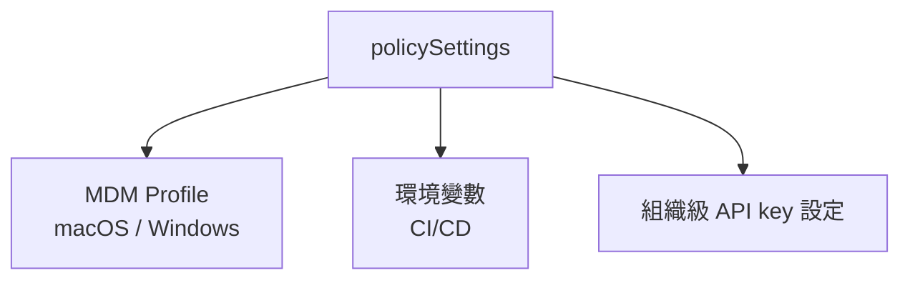
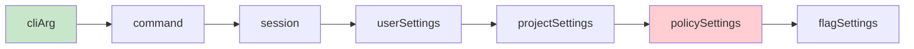

# Policy Limits 團隊管控

## 概述

Policy Limits 是 [[Rate Limiting 三層額度管控|Rate Limiting]] 的 Layer 3，提供組織/企業級別的資源管控。透過 MDM（Mobile Device Management）或企業策略下發，管理員可以控制 Claude Code 的使用範圍。

## 管控維度

| 維度 | 說明 |
|------|------|
| **Token 配額** | 每人/每天/每月的 token 上限 |
| **模型限制** | 允許使用的模型列表 |
| **工具限制** | 禁止使用的工具（如 WebFetch）|
| **功能限制** | 禁止的 feature flags |
| **成本上限** | 每 session / 每月的美元上限 |

## 策略來源

## 優先序

Policy settings 在權限規則引擎中的優先序：

Policy 優先序相對較低，但它的 **deny 規則仍然最高**——管理員可以在 policy 中加入 deny 規則，這些規則無法被用戶覆蓋。

## 企業場景

| 場景 | 策略 |
|------|------|
| 限制模型使用 | 只允許 Sonnet（禁止 Opus）|
| 合規要求 | 禁止 WebFetch（不允許外部請求）|
| 成本控制 | 每人每月上限 $100 |
| 安全加固 | 強制 sandbox、禁止特定 bash 命令 |

## 與 Team Memory 的配合

Policy Limits 管控「能做什麼」，[[Team Memory 跨用戶共享]] 管控「知道什麼」。兩者配合實現：
- 管理員控制 agent 的能力邊界
- 團隊記憶確保 agent 遵循團隊規範

## 關聯筆記

- [[Rate Limiting 三層額度管控]] — Layer 3
- [[權限規則引擎]] — Policy 的 deny 規則
- [[Team Memory 跨用戶共享]] — 團隊知識共享
- [[模型配置與 Provider 支援]] — 模型限制的實現

---

> [!tip] 導航
> 返回 [[Cost Engineering MOC]] · [[Claude Code 逆向工程知識庫]]
