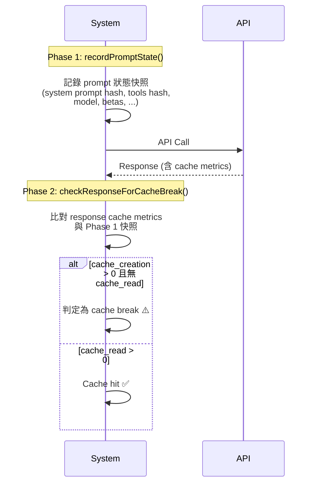

# Prompt Cache 策略與 Break Detection

## 概述

Prompt Cache 是 Claude Code 成本最佳化的核心機制。Cache hit 節省 ~90% 的 input token 成本，但 cache write 比正常貴 25%，因此**避免不必要的 cache break 是關鍵**。

## 兩階段偵測架構



## stripCacheControl() — 內容雜湊獨立性

```typescript
// 移除 cache_control 標記後再計算 hash
// 確保 cache control 設定的變更不影響「內容是否相同」的判斷
const contentHash = hash(stripCacheControl(content))
```

## 追蹤的因素

| 因素 | 變更影響 |
|------|---------|
| System Prompt 內容 | cache break |
| Tool Schemas | cache break |
| Model | cache break |
| Beta flags | cache break |
| Cache Control 設定 | **不影響**（已 strip）|

## 原因診斷系統

Cache break 時自動診斷原因：

```typescript
enum CacheBreakReason {
  SYSTEM_PROMPT_CHANGED = 'system_prompt_changed',
  TOOLS_CHANGED = 'tools_changed',
  MODEL_CHANGED = 'model_changed',
  BETAS_CHANGED = 'betas_changed',
  FIRST_REQUEST = 'first_request',
  UNKNOWN = 'unknown',
}
```

## Tracking Key 設計

不同的 query 來源使用不同的 tracking key，避免互相干擾：

| Key | 來源 | 說明 |
|-----|------|------|
| `main` | 主 agent query | 最重要的追蹤 |
| `compact` | compaction query | 壓縮時的獨立追蹤 |
| `extract` | ExtractMemories | 記憶提取的追蹤 |
| `dream` | AutoDream | 夢境整合的追蹤 |

## Overage State Latching（Sticky Latch）

```typescript
// 一旦進入 overage → 鎖住狀態
// 防止計費狀態變更 → prompt 變更 → cache break
if (isOverage) {
  latchOverageState()
  // 即使之後恢復正常，也保持 overage 設定
  // 直到 session 結束
}
```

> [!important] 核心洞察
> 計費狀態（overage/normal）會影響 system prompt 內容（如顯示成本警告）。如果計費狀態在正常→超額之間來回切換，會反覆造成 cache break。Sticky Latch 透過「只進不出」解決此問題。

→ 詳見 [[Cache 穩定性工程模式]]

## Cache 降級通知

系統主動通知預期的 cache 失效：

| 通知類型 | 觸發 | 效果 |
|----------|------|------|
| `notifyDeletion()` | messages 刪除 | 標記為預期的 cache break |
| `notifyCompaction()` | context 壓縮 | 標記為預期的 cache break |

預期的 cache break 不發送 analytics 事件，避免誤報。

## Debug Diff 輸出

Cache break 時輸出 diff 文件到 `~/.claude/debug/`，幫助排查具體是哪個部分變更導致 break。

## Analytics 事件

```typescript
track('tengu_prompt_cache_break', {
  reason: CacheBreakReason,
  trackingKey: string,
  previousHash: string,
  currentHash: string,
})
```

## 關聯筆記

- [[Context Engineering 多層管道]] — Cache 設計影響 Context 管道
- [[成本追蹤架構]] — Cache 與成本的直接關係
- [[Cache 穩定性工程模式]] — 跨領域的 Cache 穩定性模式
- [[System Prompt 動態組裝邏輯]] — Dynamic Boundary 設計

---

> [!tip] 導航
> 返回 [[Cost Engineering MOC]] · [[Harness Engineering MOC]] · [[Claude Code 逆向工程知識庫]]
