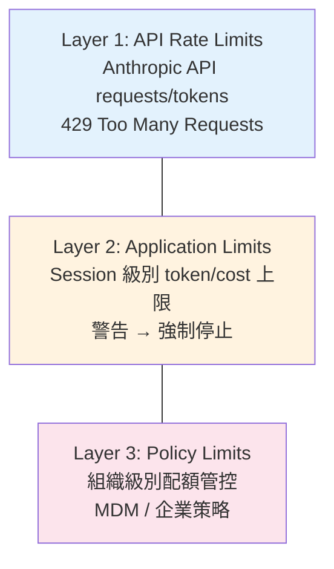

# Rate Limiting 三層額度管控

## 概述

Claude Code 實現了三層 rate limiting，從 API 層到應用層到組織策略層，確保資源使用在合理範圍內。

## 三層架構



## Layer 1: API Rate Limits

從 API response headers 解析：

```
anthropic-ratelimit-requests-limit: 1000
anthropic-ratelimit-requests-remaining: 995
anthropic-ratelimit-requests-reset: 2025-04-05T12:00:00Z
anthropic-ratelimit-tokens-limit: 100000
anthropic-ratelimit-tokens-remaining: 85000
anthropic-ratelimit-tokens-reset: 2025-04-05T12:00:00Z
```

### 重試策略

| 狀態碼 | 策略 |
|--------|------|
| 429 | 指數退避（exponential backoff）|
| 529 | 伺服器過載，較長退避 |
| 5xx | 退避重試 |

## Layer 2: Application Limits

應用層的 session 級別限制：

```typescript
// Token 使用量警告
if (sessionTokens > WARNING_THRESHOLD) {
  showWarning("接近 token 上限")
}

// 強制停止
if (sessionTokens > MAX_THRESHOLD) {
  forceStop("已達 session token 上限")
}
```

## Layer 3: Policy Limits

→ 詳見 [[Policy Limits 團隊管控]]

## 關聯筆記

- [[成本追蹤架構]] — Rate Limit 與成本追蹤的整合
- [[Policy Limits 團隊管控]] — Layer 3 詳解
- [[API 呼叫層架構]] — API 層的錯誤處理

---

> [!tip] 導航
> 返回 [[Cost Engineering MOC]] · [[Claude Code 逆向工程知識庫]]
