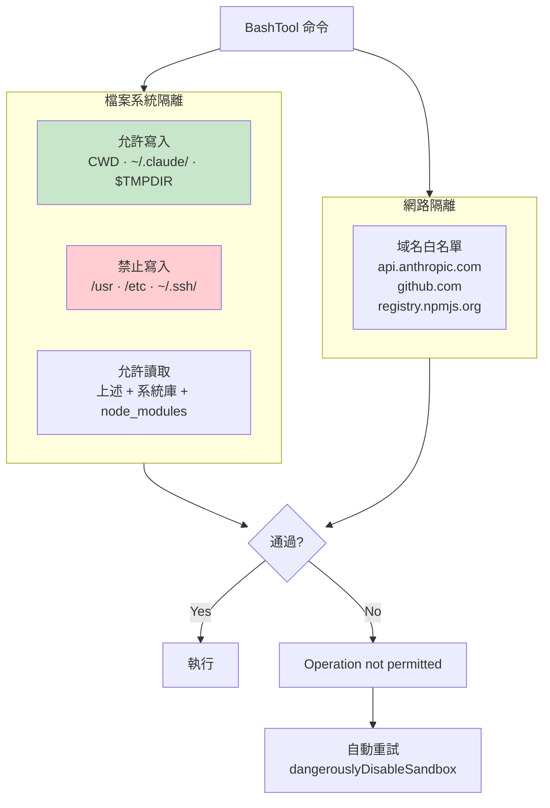

# Sandbox 沙箱隔離機制

## 概述

OS Sandbox 是 [[七層縱深防禦模型]] 的最後一道防線（Layer 7），提供作業系統層級的檔案系統和網路隔離。即使所有應用層安全檢查都被繞過，沙箱仍能限制實際的系統存取。

## 平台實作

| 平台 | 技術 | 特性 |
|------|------|------|
| **Linux** | bubblewrap (bwrap) | 容器化隔離 |
| **macOS** | sandbox-runtime | macOS 原生沙箱 |

## 隔離架構總覽



## 檔案系統隔離

### 允許寫入
- Project CWD 及其子目錄
- `~/.claude/` 設定目錄
- `$TMPDIR` 臨時目錄

### 禁止寫入
- 系統目錄（`/usr`, `/etc`, `/bin`）
- 其他用戶的 home 目錄
- `~/.ssh/`、`~/.gnupg/` 等敏感目錄

### 允許讀取
- 所有上述可寫入路徑
- 系統共享庫和 runtime
- 專案依賴（`node_modules` 等）

## 網路隔離

**域名白名單**：只允許連接到已知安全的域名

```
api.anthropic.com    — Claude API
github.com           — Git 操作
registry.npmjs.org   — npm 安裝
pypi.org             — pip 安裝
...
```

## BashTool 整合

```typescript
// Sandbox 失敗時的自動重試策略
if (isSandboxError(error)) {
  // 證據：
  // - "Operation not permitted" errors
  // - Access denied to specific paths
  
  // 立即重試，disable sandbox
  retry with dangerouslyDisableSandbox: true
  // 不需要詢問用戶
}
```

> [!warning] dangerouslyDisableSandbox
> 當 sandbox 導致合法操作失敗時，BashTool prompt 指導模型直接重試並禁用 sandbox。這是一個有意識的權衡——避免 sandbox 誤判阻塞工作流。

## Prompt 中的 Sandbox 路徑正規化

```typescript
// 正規化 temp dir 路徑
// $TMPDIR 替代實際路徑（如 /tmp/uid-12345/）
// 避免 per-uid 路徑不同造成跨用戶 cache miss
const normalizeAllowOnly = (paths) =>
  paths.map(p => (p === claudeTempDir ? '$TMPDIR' : p))
```

→ 詳見 [[Cache 穩定性工程模式]]

## 關聯筆記

- [[七層縱深防禦模型]] — Layer 7
- [[BashTool 深度剖析]] — Sandbox 的主要消費者
- [[Security 設計模式集]] — 縱深防禦的最後防線
- [[Cache 穩定性工程模式]] — Sandbox 路徑正規化

---

> [!tip] 導航
> 返回 [[Security & Permissions MOC]] · [[Claude Code 逆向工程知識庫]]
