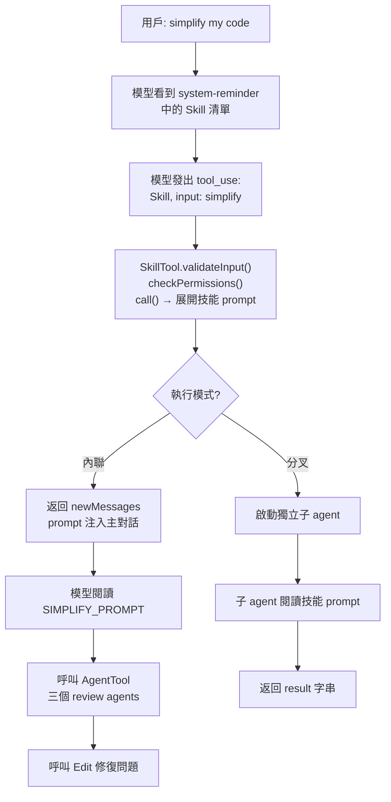

# SkillTool 與 Skills 系統

## 概述

Skills 是 Claude Code 的「行為模板」——本質是帶有 metadata 的 Markdown prompt。Skill 被呼叫時，其 prompt 被注入對話，告訴模型「如何完成這類任務」，模型再使用可用的 Tools 去執行。

SkillTool 是 Tool 與 Skill 之間的**橋接器**。

## 執行流程



## Skill 的結構

```typescript
registerBundledSkill({
  name: 'simplify',
  allowedTools: [],              // 技能授權的工具
  model: undefined,              // 可選：覆寫模型
  effort: undefined,             // 可選：覆寫思考深度
  context: undefined,            // 'fork' 表示分叉執行
  async getPromptForCommand(args, context) {
    return [{ type: 'text', text: SIMPLIFY_PROMPT }]
  },
})
```

## 三種 Skill 來源

| 來源 | 路徑 | 門檻 |
|------|------|------|
| **Bundled** | `src/skills/bundled/` | TypeScript 開發 |
| **User** | `~/.claude/skills/<name>/SKILL.md` | 寫 Markdown |
| **Project** | `.claude/skills/<name>/SKILL.md` | 寫 Markdown |

→ 完整列表見 [[16 Bundled Skills 目錄]]

## allowedTools 機制

Skill 的 `allowedTools` 透過 `contextModifier` 注入到對話上下文，自動解鎖指定工具的權限：

```typescript
// 技能呼叫後，allowedTools 中的工具不再需要用戶授權
contextModifier(ctx) {
  // 擴展 alwaysAllowRules
  return { ...ctx, toolPermissionContext: { ...expanded } }
}
```

## 內聯 vs 分叉

| 執行模式 | 優點 | 適用場景 |
|----------|------|---------|
| **內聯** | 可問用戶、可修改主對話狀態 | 互動式任務（update-config、remember）|
| **分叉** | 不消耗主 context、可並行 | 自含式長任務（完整分析）|

## 三個獨特能力

1. **技能遞迴**：Skill 可呼叫其他 Skill（如 batch → simplify）
2. **技能 + Agent 組合**：Skill 可編排多個 AgentTool 並行工作
3. **技能自我生成**：`/skillify` 從 session 歷史生成新 SKILL.md

## 權限模型

兩層權限：
1. **SkillTool 本身**：呼叫技能是否需要確認
2. **技能內部工具**：透過 `allowedTools` 授權

**自動允許條件**：只用了唯讀工具（Read/Grep/Glob）的技能自動允許。

## 關聯筆記

- [[Skills vs Tools 設計哲學]] — Tool 與 Skill 的本質差異
- [[16 Bundled Skills 目錄]] — 完整 Skill 清單
- [[36 工具系統總覽]] — SkillTool 在工具體系中的位置
- [[Tool Prompt 設計模式集]] — 模式 3（觸發規則）、模式 5（Feature Flag）

---

> [!tip] 導航
> 返回 [[Tool System MOC]] · [[Claude Code 逆向工程知識庫]]
