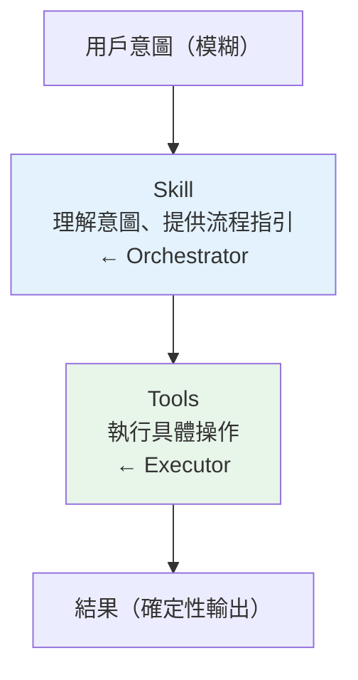

# Skills vs Tools 設計哲學

## 根本差異

| 維度 | Tool（工具）| Skill（技能）|
|------|-----------|-------------|
| **本質** | 原子能力（TypeScript 程式碼）| 行為模板（Markdown prompt）|
| **執行者** | 程式碼直接執行 | 模型閱讀 prompt 後間接執行 |
| **輸入** | JSON（Zod schema 驗證）| 字串（技能名稱 + 可選 args）|
| **輸出** | 結構化 JSON | 模型的行為（透過 Tools）|
| **類比** | 機器語言 | 需求規格書 |

## 設計哲學對比

### Tools：確定性與原子性
- **確定性**：相同輸入 → 相同操作
- **原子性**：每個 Tool 做一件事，做完返回結果
- **可組合**：多個 Tool 的輸出是下一個的輸入
- **可驗證**：結果是結構化資料，可 schema 驗證

### Skills：意圖與靈活性
- **意圖導向**：描述「應該做什麼」而非「如何做」
- **靈活性**：允許模型根據上下文調整執行策略
- **知識封裝**：將領域知識嵌入 prompt
- **人機協作**：可暫停詢問用戶

## 互補關係



> [!info] Skill = Orchestrator, Tool = Executor
> Skill 解決「做什麼」，Tool 解決「怎麼做」。

## 擴展性對比

### 新增 Tool
1. 實作 `Tool<InputSchema, Output>` 介面
2. 提供 `inputSchema`、`call()`、`checkPermissions()` 實作
3. 在工具列表中註冊
4. **需要** TypeScript 開發能力

### 新增 Skill
**User/Project Skill（最低門檻）：**
1. 建立 `~/.claude/skills/<name>/SKILL.md`
2. 寫 frontmatter（`allowed-tools`, `when_to_use`）
3. 寫 prompt 內容
4. **只需要** 寫 Markdown

**自動生成：**
```
用 /skillify 指令 → 分析 session → 訪談用戶 → 生成 SKILL.md
```

## 工作流中的分工

| 任務類型 | 應使用 | 原因 |
|---------|--------|------|
| 讀取/寫入檔案 | **Tool** | 確定性操作 |
| 執行 shell 命令 | **Tool** | 需要輸出 |
| 配置 settings.json | **Skill** | 需要知識（hooks 語法） |
| 代碼品質審查 | **Skill** | 需要判斷和並行協調 |
| 大規模 migration | **Skill** | 研究→計劃→並行執行 |
| 一次性自定義工作流 | **User Skill** | 封裝領域知識 |

## 關聯筆記

- [[36 工具系統總覽]] — Tool 體系全貌
- [[SkillTool 與 Skills 系統]] — Skill 的實作機制
- [[16 Bundled Skills 目錄]] — 完整 Skill 清單
- [[Harness Engineering 定義與公式]] — Tools 是 Harness 公式的核心組件

---

> [!tip] 導航
> 返回 [[Tool System MOC]] · [[Claude Code 逆向工程知識庫]]
