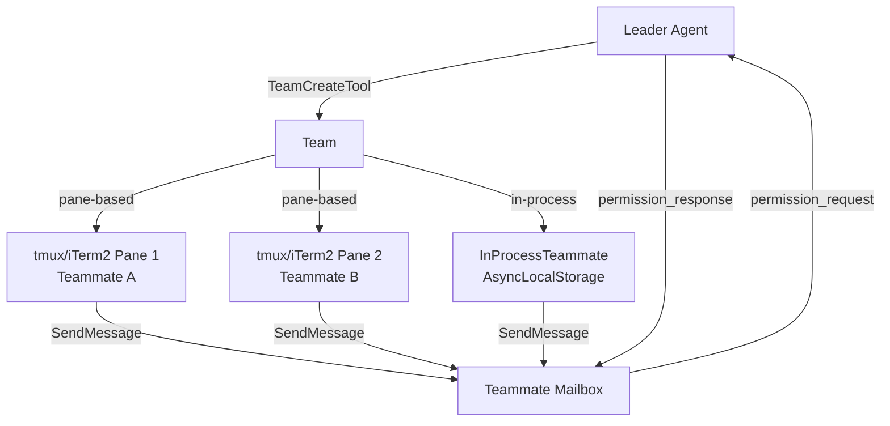

# Swarm 與 Teammate 多 Agent 協作

## 概述

Swarm/Team 系統是比 [[Coordinator Mode 多 Agent 協調|Coordinator Mode]] 更複雜的多 Agent 協作框架。它支援長期運行的團隊、pane-based 執行、以及完整的信箱通訊系統。

## 架構



## 與 Coordinator Mode 的區別

| 特性 | Coordinator Mode | Swarm/Team |
|------|-----------------|------------|
| 觸發 | 環境變數/flag | TeamCreate 工具 |
| 通訊 | AgentTool 回傳值 | **Mailbox 信箱系統** |
| 隔離 | 同進程 subagent | **tmux pane / in-process** |
| 生命週期 | 單次任務 | **長期團隊** |
| 權限 | 各自獨立 | **Leader 集中管理** |
| 複雜度 | 較低 | 較高 |

## Teammate Mailbox

Mailbox 是 Teammate 的非同步通訊機制：

```typescript
class TeammateMailbox {
  // Teammate 發送訊息
  send(message: string): void
  
  // Leader 接收訊息
  receive(): Promise<Message>
  
  // 權限請求 → Leader 代為決策
  requestPermission(tool: string, input: any): Promise<Decision>
}
```

## 通訊可見性契約

> [!warning] 重要原則
> ```
> Your plain text output is NOT visible to other agents.
> To communicate, you MUST call SendMessageTool.
> Your team cannot hear you if you do not use the SendMessage tool.
> ```

普通文字輸出不會傳遞給其他 agent。必須使用 [[Agent 間通訊機制|SendMessageTool]] 才能通訊。

## 權限同步

Teammate 的權限請求會透過 Mailbox 轉發給 Leader：
1. Teammate 嘗試執行需要權限的操作
2. `permission_request` 發送到 Mailbox
3. Leader 收到後決定 allow/deny
4. `permission_response` 回傳給 Teammate

## 執行模式

### Pane-Based（tmux/iTerm2）
- 每個 Teammate 在獨立的 terminal pane 中運行
- 真正的進程隔離
- 用戶可以看到每個 Teammate 的即時輸出

### In-Process
- 使用 Node.js `AsyncLocalStorage` 做邏輯隔離
- 共享同一進程，開銷更低
- 適合短期協作任務

## 關聯筆記

- [[Coordinator Mode 多 Agent 協調]] — 更簡單的多 Agent 模式
- [[Agent 系統三層架構]] — Swarm 在 Layer 3
- [[Agent 間通訊機制]] — 通訊的詳細機制
- [[Task 系統與狀態機]] — InProcessTeammateTaskState

---

> [!tip] 導航
> 返回 [[Agent Architecture MOC]] · [[Claude Code 逆向工程知識庫]]
