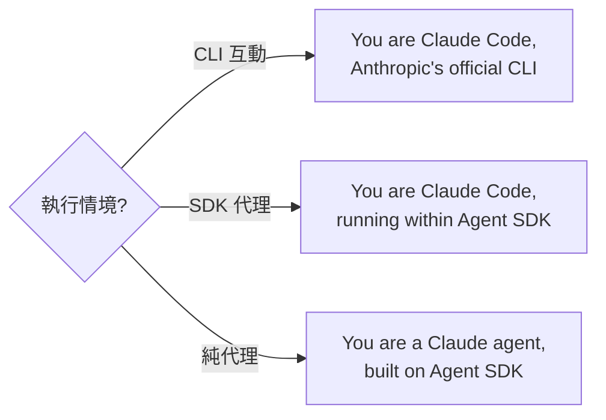
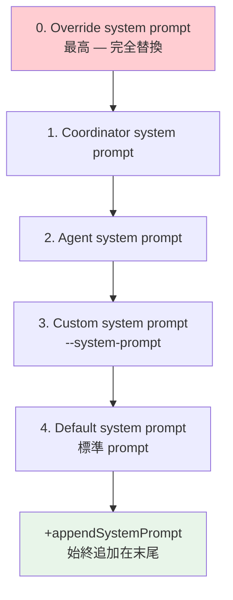

# System Prompt 動態組裝邏輯

## 概述

Claude Code 的 System Prompt 不是一段靜態文字，而是由多個組件動態組裝而成的分層結構，經過精心設計以最大化 [[Prompt Cache 策略與 Break Detection|Prompt Cache]] 命中率。

## 組裝流程

```typescript
function getSystemPrompt(): SystemPrompt {
  return asSystemPrompt([
    // --- 靜態部分（scope: 'global' 可緩存）---
    getSimpleIntroSection(outputStyleConfig),   // 身份宣告
    getSimpleSystemSection(),                    // 系統資訊
    getSimpleDoingTasksSection(),                // 任務規範
    getActionsSection(),                         // 行為準則
    getUsingYourToolsSection(enabledTools),      // 工具使用指引
    // ...
    // === 動態邊界 ===
    SYSTEM_PROMPT_DYNAMIC_BOUNDARY,
    // --- 動態部分（Registry 管理）---
    ...resolvedDynamicSections,
  ])
}
```

## 靜態部分（Cache-Stable）

| Section | 內容 | 行數 |
|---------|------|------|
| **Intro** | 身份宣告 + 風格設定 | ~30 |
| **System** | OS、shell、CWD 等系統資訊 | ~15 |
| **DoingTasks** | Minimal Footprint 哲學 | ~50 |
| **Actions** | 可逆性框架、安全原則 | ~40 |
| **UsingTools** | 工具使用規範 | ~60 |
| **CyberRisk** | 安全指令 | ~80 |

### 多層身份設計

同一基礎模型在不同執行情境使用不同身份：



### Minimal Footprint 哲學

```
- Don't add features beyond what was asked
- Don't add error handling for impossible scenarios
- Don't create helpers for one-time operations
- Three similar lines > premature abstraction
```

## Dynamic Boundary

```typescript
export const SYSTEM_PROMPT_DYNAMIC_BOUNDARY = '__SYSTEM_PROMPT_DYNAMIC_BOUNDARY__'
```

這個標記分隔「可全局緩存」和「包含 session 特定資訊」的部分。

> [!important] Cache 影響
> 靜態部分所有用戶共享同一 cache → 命中率接近 100%
> 動態部分因包含 CWD、語言、MCP 指令等 → 無法全局緩存

→ 詳見 [[Context Engineering 多層管道]]、[[Cache 穩定性工程模式]]

## 動態部分（Registry 管理）

動態段落透過 `SystemPromptSection` registry 管理：

| 段落 | 內容 | 是否 Cache-Break |
|------|------|-----------------|
| Memory 內容 | MEMORY.md | ✅ 每用戶不同 |
| MCP 指令 | MCP server 連接資訊 | ✅ 隨時變化 |
| Session 指引 | 工具條件、skill 設定 | ✅ 條件判斷 |
| Tool Search 結果 | 延遲載入的工具資訊 | ✅ 動態 |

### DANGEROUS_ 前綴 API

```typescript
DANGEROUS_uncachedSystemPromptSection(
  'mcp_instructions',
  () => getMcpInstructionsSection(mcpClients),
  'MCP servers connect/disconnect between turns',  // 強制填寫理由
)
```

→ 詳見 [[Prompt Engineering 設計模式集]] 模式 8

## 優先序機制

當多個 prompt 來源衝突時，遵循明確的優先序：



## Branded Type 防護

```typescript
export type SystemPrompt = readonly string[] & {
  readonly __brand: 'SystemPrompt'
}
```

使用 TypeScript Branded Type 防止未組裝的 `string[]` 被意外傳入需要 `SystemPrompt` 的位置。

→ 詳見 [[Prompt Engineering 設計模式集]] 模式 7

## 關聯筆記

- [[Context Engineering 多層管道]] — System Prompt 是 Context 的第一層
- [[Prompt Cache 策略與 Break Detection]] — Cache 設計直接影響組裝架構
- [[輔助 Prompt 子系統]] — 注入到動態部分的子系統
- [[Cyber Risk 安全指令]] — 靜態部分的安全指令

---

> [!tip] 導航
> 返回 [[Prompt Engineering MOC]] · [[Claude Code 逆向工程知識庫]]
