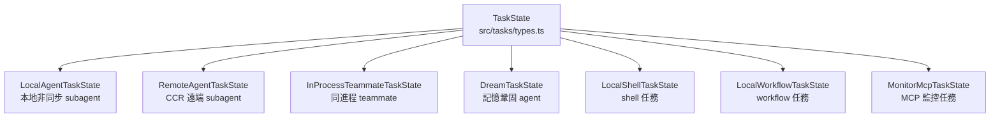
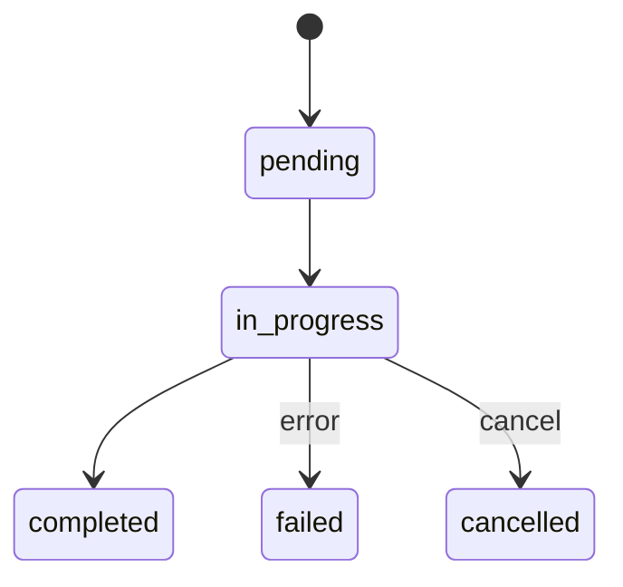
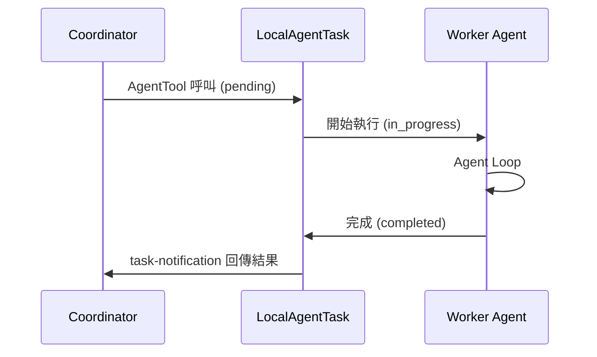

# Task 系統與狀態機

## 概述

Task 系統管理 Claude Code 中所有非同步任務的生命週期。每個 subagent、background job、teammate 都以 Task 的形式被追蹤和管理。

## Task 類型體系



## 狀態機



### 狀態轉移規則

從 [[Tool Prompt 設計模式集|Tool Prompt]] 模式 6 提煉的嚴格規則：

> [!warning] 完成條件
> ```
> ONLY mark a task as completed when you have FULLY accomplished it.
> Never mark a task as completed if:
>   - Tests are failing
>   - Implementation is partial
>   - You encountered unresolved errors
> ```

## Task 管理工具

| 工具 | 功能 | 建議前置操作 |
|------|------|-------------|
| **TaskCreateTool** | 建立任務 | TaskList（避免重複）|
| **TaskUpdateTool** | 更新狀態 | TaskGet（避免 stale）|
| **TaskGetTool** | 查詢資訊 | 無 |
| **TaskStopTool** | 終止任務 | TaskGet（確認狀態）|

## Task vs Agent 的關係



## 背景任務追蹤

背景 Task 的特殊機制：
- **AgentSummary**：每 30 秒生成進度摘要
- **Task 列表查詢**：Coordinator 可以查看所有 Task 的當前狀態
- **中斷機制**：TaskStopTool 可以終止任何背景 Task

## 關聯筆記

- [[Agent 生命週期]] — Task 狀態與 Agent 生命週期的對應
- [[Coordinator Mode 多 Agent 協調]] — Task 管理的主要使用場景
- [[Agent 系統三層架構]] — Task 類型體系
- [[Tool Prompt 設計模式集]] — 模式 6（狀態機說明）

---

> [!tip] 導航
> 返回 [[Agent Architecture MOC]] · [[Claude Code 逆向工程知識庫]]
