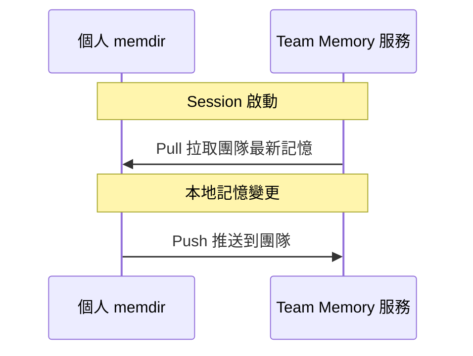

# Team Memory 跨用戶共享

## 概述

Team Memory 允許同一團隊/組織的成員共享記憶。它透過 `teamMemorySync/` 服務實現記憶的推送和拉取，讓團隊知識不只存在於個人的 memdir 中。

## 觸發時機

- Session 啟動時：pull 團隊記憶
- 記憶文件變更時：push 到團隊

Feature flag `tengu_herring_clock` 控制啟用。

## 存儲位置

```
~/.claude/projects/<project>/memory/team/
```

## 同步機制



## 失敗處理

### 永久失敗抑制

```typescript
// 永久失敗 → 設定 pushSuppressedReason
if (error === 'no_oauth' || error.status >= 400) {
  pushSuppressedReason = error
  // 停止無意義重試
}
```

> [!warning] 167K push 事件的教訓
> 超過 167K 的 push 事件直接影響了抑制機制的誕生。未被抑制的失敗重試造成大量無效流量。

### 抑制策略

| 失敗類型 | 策略 |
|----------|------|
| `no_oauth` | 永久抑制（無法認證）|
| 4xx 錯誤 | 永久抑制（客戶端錯誤）|
| 5xx 錯誤 | 退避重試 |
| 網路錯誤 | 退避重試 |

## 記憶範圍設計

| 記憶類型 | 預設範圍 |
|----------|---------|
| `user` | 私人（不分享）|
| `feedback` | 私人優先 |
| `project` | **團隊優先** |
| `reference` | **通常團隊** |

`project` 和 `reference` 類型的記憶預設推送到團隊，因為專案目標和外部系統指標對所有團隊成員有價值。

## 關聯筆記

- [[Memory 五大子系統架構]] — 在記憶體系中的位置
- [[Memdir 核心與 MEMORY.md]] — 團隊記憶的本地存儲
- [[Policy Limits 團隊管控]] — 團隊層級的管控
- [[Memory 設計原則集]] — 原則 10（失敗模式設計）

---

> [!tip] 導航
> 返回 [[Memory & Context MOC]] · [[Claude Code 逆向工程知識庫]]
