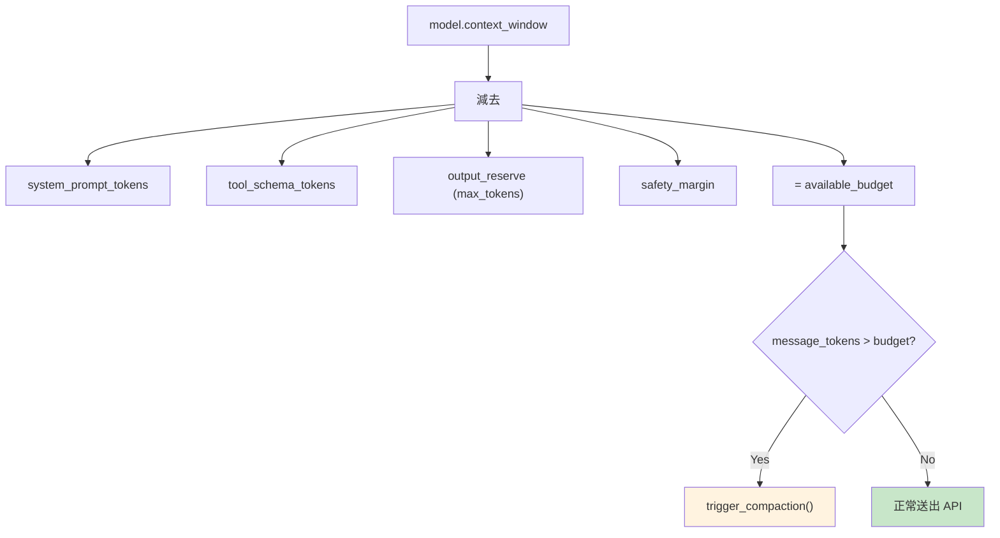

# Token Estimation 預估邏輯

## 概述

在 API 呼叫前，Claude Code 需要預估 prompt token 數量，以決定是否需要 [[Context Compaction 壓縮策略|Context Compaction]] 或截斷。

## 預估方法

### 文字 Token 預估

```typescript
function estimateTokenCount(text: string): number {
  // 粗略估算：每 4 個字元 ≈ 1 個 token（英文）
  // 中文/日文：每 1-2 個字元 ≈ 1 個 token
  return Math.ceil(text.length / CHARS_PER_TOKEN)
}
```

### Messages Token 預估

每個 message 有基礎開銷：

```
message_tokens ≈ content_tokens + role_overhead + metadata_overhead
```

### Tool Schema Token 預估

工具的 JSON schema 也消耗 context window：

```
total_tool_tokens = Σ(tool.schema_tokens)
```

## Context Budget 計算



## 截斷策略

當 messages 超出預算時：
1. 先嘗試 [[Context Compaction 壓縮策略|Compaction]]
2. 如果 compaction 後仍超限 → 截斷最舊的訊息
3. 保留 system prompt 和最近的訊息

## 關聯筆記

- [[Context Compaction 壓縮策略]] — 超限時的壓縮策略
- [[成本追蹤架構]] — Token 與成本的對應
- [[Context Engineering 多層管道]] — Token 預算在 context 管道中的角色

---

> [!tip] 導航
> 返回 [[Cost Engineering MOC]] · [[Claude Code 逆向工程知識庫]]
