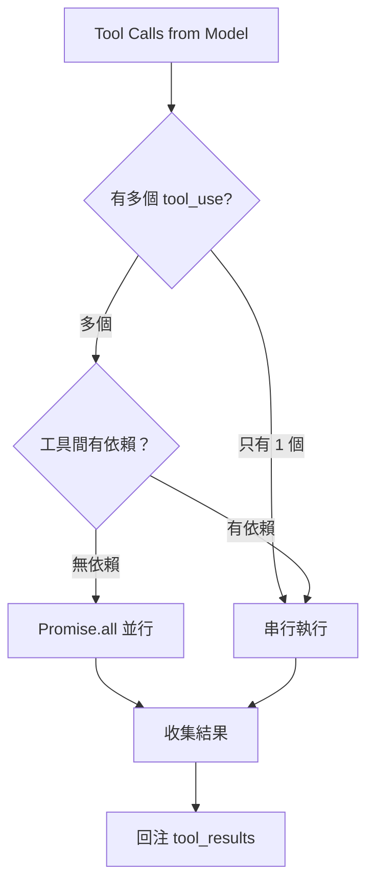
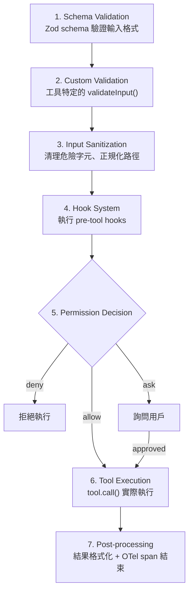

# Tool Orchestration 調度系統

## 核心架構

Tool Orchestration 由兩個檔案構成，職責清晰分離：

| 檔案 | 職責 | 類比 |
|------|------|------|
| `toolOrchestration.ts` | **如何執行一組工具** — 並行/串行策略 | 交通指揮 |
| `toolExecution.ts` | **如何執行單一工具** — 多層防護管道 | 安檢流程 |

## 並行/串行策略



**並行條件**：
- Model 在同一回應中發出多個 tool_use blocks
- 工具間沒有讀寫依賴

**串行條件**：
- 只有一個工具呼叫
- 工具有明確的前後依賴（如先 Read 再 Edit）

## 單一工具執行管道（7 層）

每個工具呼叫都經過完整的防護管道：



→ 詳見 [[工具執行多層防護管道]]、[[權限規則引擎]]

## Hook 系統

Hook 是 `settings.json` 中的使用者自訂邏輯，在工具執行管道中插入：

```json
{
  "hooks": {
    "PreToolUse": [
      {
        "matcher": "Bash",
        "hooks": [{ "type": "command", "command": "./validate.sh" }]
      }
    ]
  }
}
```

- **PreToolUse**：在權限檢查前執行，可以 approve/reject/修改輸入
- **PostToolUse**：在工具完成後執行，可以檢查結果

→ 詳見 [[Hook 系統擴展模式]]

## OpenTelemetry 追蹤

每個工具執行都有完整的 OTel span：

```mermaid
gantt
    title Tool OTel Span 結構
    dateFormat X
    axisFormat %s
    section Tool Span
        Blocked On User   :a1, 0, 3
        Tool Execution     :a2, 3, 6
```



追蹤的 attributes：tool name、file_path、command、duration、decision source

→ 詳見 [[Observability 三層可觀測性架構]]

## 錯誤分類

工具執行錯誤被分為幾個等級：

| 錯誤類型 | 處理方式 |
|----------|---------|
| `InputValidationError` | 回傳錯誤給模型，讓它修正輸入 |
| `PermissionDenied` | 回傳拒絕原因，模型選擇替代方案 |
| `ExecutionError` | 回傳錯誤訊息，模型決定是否重試 |
| `Timeout` | 終止執行，回傳 timeout 訊息 |

> [!info] 錯誤即 Feedback
> 錯誤不會中斷 Agent Loop，而是作為 tool_result 回注到對話中，讓模型從錯誤中學習並調整策略。這是 [[Agent Loop 核心執行機制|Agent Loop]] feedback loop 的重要組成部分。

## 關聯筆記

- [[Agent Loop 核心執行機制]] — Tool Orchestration 是 Agent Loop 的「執行」階段
- [[工具執行多層防護管道]] — 單一工具的安全管道詳解
- [[七層縱深防禦模型]] — 安全層面的工具保護
- [[並行與 Async Generator 模式]] — 並行策略的設計模式
- [[Harness Engineering 12 原則]] — 原則 2（多層工具執行管道）

---

> [!tip] 導航
> 返回 [[Harness Engineering MOC]] · [[Tool System MOC]] · [[Claude Code 逆向工程知識庫]]
