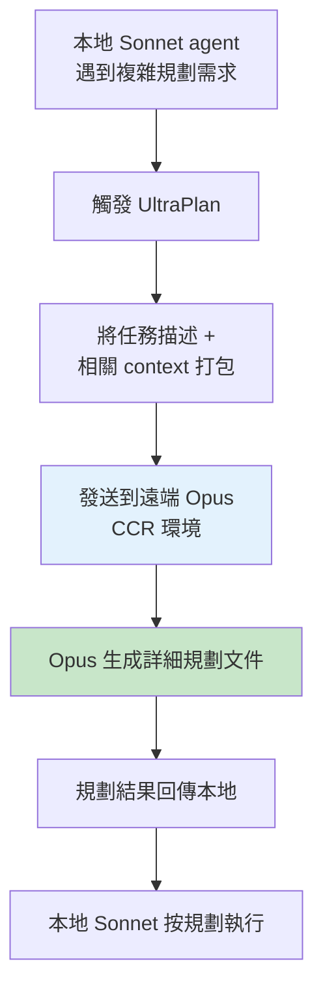

# UltraPlan 遠端規劃機制

## 概述

UltraPlan 允許 Claude Code 將複雜的規劃任務派遣到遠端的 Opus 模型（最強推理能力），在不增加本地 context 負擔的情況下獲得高品質的規劃結果。

## 啟用方式

```typescript
if (feature('ULTRAPLAN')) {
  // 載入 UltraPlan 功能
}
```

## 工作流程



## 設計動機

| 問題 | 解決 |
|------|------|
| Sonnet 的規劃能力有限 | 用 Opus 做規劃 |
| Opus 太貴不能全程用 | 只在規劃階段用 |
| 規劃消耗 context | 遠端執行不佔本地 context |

## 與其他規劃工具的區別

| 工具 | 模型 | 執行位置 | 深度 |
|------|------|---------|------|
| EnterPlanMode | 繼承主 agent | 本地 | 中 |
| Plan Agent | 繼承主 agent | 本地（fork）| 中 |
| **UltraPlan** | **Opus** | **遠端** | **高** |

## 關聯筆記

- [[82 個未公開 Feature Flags]] — `ULTRAPLAN` flag
- [[Model Selection 與成本路由]] — Opus 用於高推理需求
- [[Coordinator Mode 多 Agent 協調]] — 規劃 → 執行的模式

---

> [!tip] 導航
> 返回 [[Claude Code 逆向工程知識庫]]
