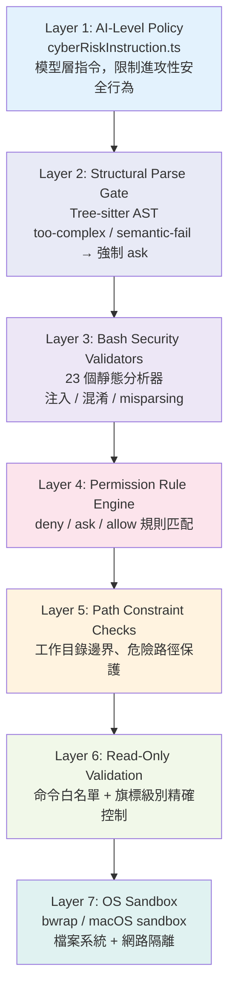
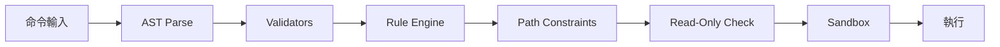

# 七層縱深防禦模型

## 概述

Claude Code 的安全架構採用縱深防禦（Defense-in-Depth），分為七個獨立層次。每層假設其他層可能失效，獨立提供安全保障。

## 七層架構

## 各層詳解

### Layer 1: AI 模型指令層
- **檔案**：`cyberRiskInstruction.ts`
- **作用**：告訴模型哪些安全請求可協助、哪些必須拒絕
- **特點**：最軟的防線，但覆蓋面最廣

→ 詳見 [[Cyber Risk 安全指令]]

### Layer 2: 結構解析閘門
- **技術**：Tree-sitter AST 解析
- **判定**：`simple`（繼續）/ `too-complex`（ask）/ `semantic-fail`（ask）
- **原則**：無法解析 = 不安全 → Fail-Closed

→ 詳見 [[Bash 命令安全過濾與 AST 解析]]

### Layer 3: 靜態安全驗證器
- **數量**：23 個 validator
- **分類**：`misparsingValidators`（語法差異攻擊）+ `nonMisparsingValidators`（一般危險模式）
- **偵測**：命令替換、backtick 注入、encoding 混淆

### Layer 4: 權限規則引擎
- **規則類型**：deny / ask / allow
- **匹配模式**：exact / prefix / wildcard
- **來源**：CLI arg / session / userSettings / projectSettings / policySettings

→ 詳見 [[權限規則引擎]]

### Layer 5: 路徑約束
- **CWD 白名單**：只允許 project CWD + additionalDirectories
- **危險路徑保護**：`.git`、`.claude`、`~/.ssh`、`/etc`
- **Symlink 解析**：同時檢查原始路徑和解析後路徑

### Layer 6: 唯讀驗證
- **白名單旗標驗證**：每個「唯讀」命令精確列出允許的 flags
- **特殊案例**：`git diff -S` 必須是 `'string'` 型（防注入）

→ 詳見 [[唯讀模式與檔案系統權限]]

### Layer 7: OS 沙箱
- **Linux**：bubblewrap (bwrap) 容器
- **macOS**：sandbox-runtime 沙箱
- **隔離**：檔案系統讀寫 + 網路域名白名單

→ 詳見 [[Sandbox 沙箱隔離機制]]

## 關鍵設計決策

| 決策 | 說明 |
|------|------|
| **Fail-Closed** | 無法解析 → 要求許可（不是自動允許）|
| **Deny 優先** | deny 規則在所有允許路徑之前檢查 |
| **Env Var 非對稱** | Allow 只剝安全 env var；Deny 剝所有 |
| **複合命令保護** | 前綴規則不匹配複合命令 |
| **Symlink 雙檢** | 同時檢查原始路徑和解析後路徑 |

## 決策流程

## 關聯筆記

- [[BashTool 深度剖析]] — 涵蓋所有 7 層的核心工具
- [[Bash 命令安全過濾與 AST 解析]] — Layer 2-3 詳解
- [[權限規則引擎]] — Layer 4 詳解
- [[Sandbox 沙箱隔離機制]] — Layer 7 詳解
- [[Security 設計模式集]] — 可遷移的安全設計模式
- [[Harness Engineering 定義與公式]] — Permissions 是 Harness 公式的一部分

---

> [!tip] 導航
> 返回 [[Security & Permissions MOC]] · [[Claude Code 逆向工程知識庫]]
