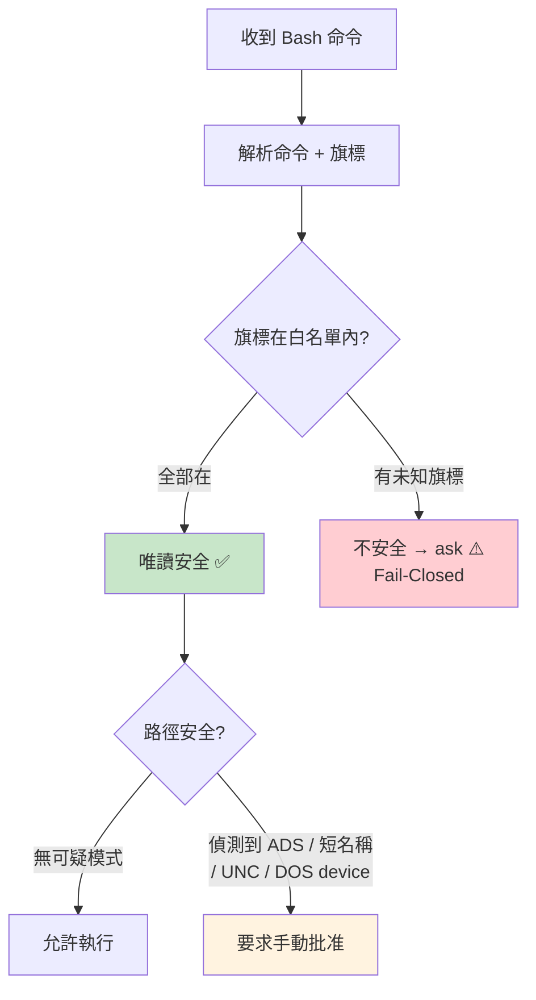

# 唯讀模式與檔案系統權限

## 概述

唯讀驗證是 [[七層縱深防禦模型]] 的 Layer 6，提供命令白名單和旗標級別的精確控制。對於應該是「唯讀」的命令，系統精確列舉所有允許的旗標。

## 驗證流程



## 白名單旗標驗證

```typescript
type FlagArgType = 'none' | 'string' | 'number' | 'char' | '{}' | 'EOF'

validateFlags(args: string[], safeFlags: Record<string, FlagArgType>): boolean
// 遇到不在 safeFlags 的旗標 → return false（不安全）
```

### 特殊案例

> [!warning] 旗標語義的隱藏風險

**`git diff -S` 必須是 `'string'`**：
- 若設為 `'none'`：`git diff -S -- --output=/tmp/pwned`
- validator 認為 `-S` 無引數 → `--` 成為選項終止符
- 但 git 的 getopt 把 `--` 當成 `-S` 的引數 → `--output=` 導致任意檔案寫入

**`xargs -i`/`-e` 必須排除**：
- `echo /sbin/cmd | xargs -it tail user@evil.com`
- validator：`-it` bundle → `tail` 在白名單 → 允許
- GNU xargs：`-i` 需要 attached arg → `t` 是 replace-str → 執行 `/sbin/cmd`

**`fd --list-details`（`-l`）必須排除**：
- 內部呼叫系統 `ls` 子程序
- 若 PATH 被污染 → 可執行惡意 `ls`

## 唯讀命令白名單

涵蓋三個 shell 工具：

| 工具 | 白名單範圍 |
|------|-----------|
| **BashTool** | git log/diff/status、ls、cat、ripgrep、gh 等 |
| **PowerShellTool** | Get-* cmdlets、Select、Where 等 |
| **ShellTool** | 類似 BashTool |

## 檔案系統權限

### FileReadTool
- `filesystem.ts` 規則匹配
- UNC 路徑保護（Windows）
- 符號連結解析防繞過

### FileEditTool
- 危險路徑黑名單：`.git/`、`.claude/`、`~/.ssh/`
- 工作目錄邊界限制
- 強制先 Read 後才能 Edit

### 可疑路徑偵測

> [!info] 偵測而非正規化
> 系統偵測可疑路徑模式並要求手動批准，而非嘗試正規化路徑。
> 原因：正規化依賴檔案系統狀態、有 TOCTOU 競爭條件、跨平台困難。

偵測的模式：
- NTFS ADS（`:` 語法）
- 8.3 短名稱（`~\d`）
- Long path prefix（`\\?\`）
- 尾部點/空格
- DOS device names
- UNC 路徑

→ 詳見 [[Security 設計模式集]] 模式 8

## 關聯筆記

- [[七層縱深防禦模型]] — Layer 5-6
- [[BashTool 深度剖析]] — 唯讀驗證的主要消費者
- [[Security 設計模式集]] — 模式 7（白名單旗標驗證）、模式 8（可疑路徑偵測）

---

> [!tip] 導航
> 返回 [[Security & Permissions MOC]] · [[Claude Code 逆向工程知識庫]]
