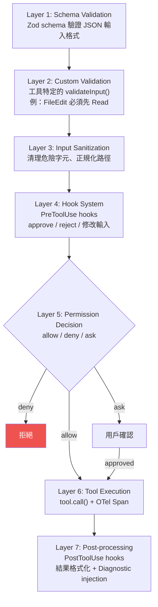
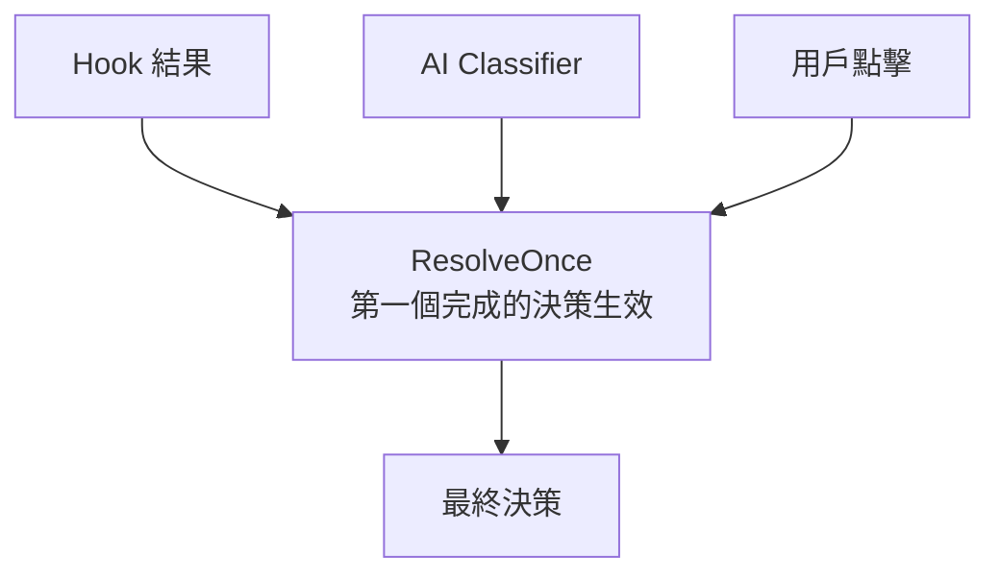

# 工具執行多層防護管道

## 概述

每個工具呼叫都經過 7 層防護管道，確保安全性、正確性和可觀測性。這是 [[Tool Orchestration 調度系統]] 中單一工具執行的完整流程。

## 7 層管道



## Layer 1: Schema Validation

```typescript
// Zod 驗證輸入格式
const parsed = tool.inputSchema.parse(rawInput)
// 失敗 → InputValidationError 回傳給模型
```

## Layer 2: Custom Validation

工具特定的前置檢查：

| 工具 | 前置要求 | 違反後果 |
|------|---------|---------|
| FileEditTool | 必須先 Read 同一檔案 | 回傳 error |
| FileWriteTool（現有檔案）| 必須先 Read | 回傳 error |
| TaskUpdateTool | 建議先 TaskGet | staleness 風險 |

## Layer 4: Hook System

用戶自訂的 Hook 在工具執行前/後介入：

```json
{
  "hooks": {
    "PreToolUse": [{
      "matcher": "Bash",
      "hooks": [{ "type": "command", "command": "./check.sh $INPUT" }]
    }],
    "PostToolUse": [{
      "matcher": "Edit",
      "hooks": [{ "type": "command", "command": "./lint.sh $FILE" }]
    }]
  }
}
```

→ 詳見 [[Hook 系統擴展模式]]

## Layer 5: Permission Decision

三個決策源賽跑（Speculative / Race 模式）：



→ 詳見 [[權限規則引擎]]、[[Security 設計模式集]] 模式 9

## Layer 6: Tool Execution

實際執行並追蹤：

```typescript
startToolExecutionSpan()
const result = await tool.call(processedInput, context)
endToolExecutionSpan()
addToolContentEvent(result)  // 記錄輸出摘要
```

## 錯誤處理哲學

> [!info] 錯誤 = Feedback
> 工具執行的錯誤不會中斷 [[Agent Loop 核心執行機制|Agent Loop]]，而是作為 `tool_result` 回注到對話中。模型從錯誤中學習並調整策略。

## 關聯筆記

- [[Tool Orchestration 調度系統]] — 多工具的並行/串行編排
- [[七層縱深防禦模型]] — 安全層面的完整架構
- [[權限規則引擎]] — Layer 5 的詳細機制
- [[Hook 系統擴展模式]] — Layer 4 的設計模式
- [[Observability 三層可觀測性架構]] — 每層的 OTel 追蹤

---

> [!tip] 導航
> 返回 [[Tool System MOC]] · [[Security & Permissions MOC]] · [[Claude Code 逆向工程知識庫]]
