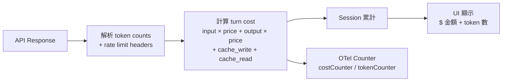

# 成本追蹤架構

## 概述

Claude Code 在 `src/cost-tracker.ts` 中實現了精確的成本追蹤系統，能即時計算每次 API 呼叫的花費，並跨 session 累積。

## 成本追蹤資料流



## 追蹤粒度

| 維度 | 追蹤項目 |
|------|---------|
| **Token** | input_tokens, output_tokens, cache_creation_input_tokens, cache_read_input_tokens |
| **成本** | 按模型定價即時計算（美元）|
| **Session** | 每個 session 獨立累計 |
| **Turn** | 每個 turn 的 token 使用量 |
| **Cache** | cache hit/miss 比率 |

## 計算公式

```
cost = (input_tokens × input_price)
     + (output_tokens × output_price)
     + (cache_creation_tokens × cache_write_price)
     + (cache_read_tokens × cache_read_price)
```

其中：
- `cache_read_price` ≈ input_price × 0.1（讀 cache 便宜 90%）
- `cache_write_price` ≈ input_price × 1.25（寫 cache 比正常貴 25%）

> [!important] Cache 經濟學
> Cache hit 能節省 ~90% input cost，但 cache write 比正常 input 貴 25%。因此，保持 cache 穩定（避免 cache break）是成本最佳化的關鍵。

→ 詳見 [[Prompt Cache 策略與 Break Detection]]

## Rate Limit Header 解析

從 API 回應 header 中解析限額資訊：

```typescript
// 解析 anthropic-ratelimit-* headers
rateLimit: {
  requestsLimit: number
  requestsRemaining: number
  requestsReset: Date
  tokensLimit: number
  tokensRemaining: number
  tokensReset: Date
}
```

→ 詳見 [[Rate Limiting 三層額度管控]]

## OTel 整合

```typescript
// Bootstrap STATE 中的 cost counter
costCounter.add(turnCost, { model, sessionId })
tokenCounter.add(totalTokens, { type: 'input' | 'output' | 'cache_read' | 'cache_write' })
```

→ 詳見 [[Observability 三層可觀測性架構]]

## 關聯筆記

- [[Prompt Cache 策略與 Break Detection]] — 成本最佳化的核心
- [[Rate Limiting 三層額度管控]] — 額度管控
- [[Model Selection 與成本路由]] — 模型選擇影響成本
- [[Observability 三層可觀測性架構]] — 成本的遙測追蹤

---

> [!tip] 導航
> 返回 [[Cost Engineering MOC]] · [[Claude Code 逆向工程知識庫]]
