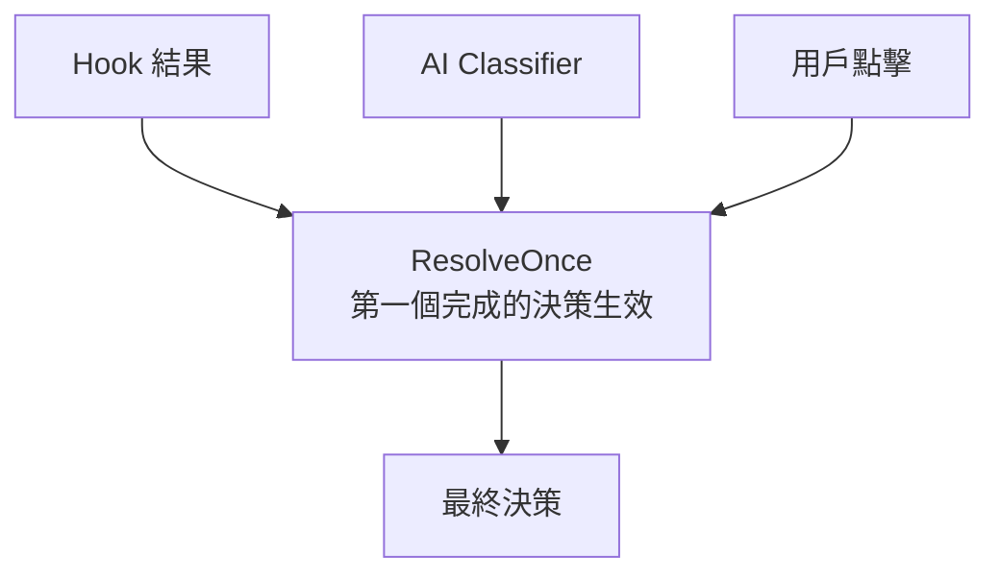

# 權限規則引擎

## 概述

權限規則引擎是 [[七層縱深防禦模型]] 的 Layer 4，負責根據多來源的規則決定工具呼叫是否被允許。

## 三類規則

| 規則類型 | 行為 | 優先序 |
|----------|------|--------|
| **deny** | 拒絕執行 | 最高 |
| **ask** | 詢問用戶確認 | 中 |
| **allow** | 允許執行 | 最低 |

> [!important] Deny-First 原則
> deny 規則永遠在 allow 規則之前檢查。即使有 allow 規則匹配，如果同時有 deny 規則匹配，deny 勝出。

## 匹配模式

| 模式 | 語法 | 範例 |
|------|------|------|
| **Exact** | `Bash(npm test)` | 精確匹配完整命令 |
| **Prefix** | `Bash(npm:*)` | 匹配 `npm` 開頭的命令 |
| **Wildcard** | `Bash(*)` | 匹配任何 bash 命令 |

## 規則來源優先序

```
1. cliArg           — 命令列參數（最高）
2. command          — 對話中用戶指令
3. session          — 本次 session 的臨時規則
4. userSettings     — ~/.claude/settings.json
5. projectSettings  — .claude/settings.json
6. policySettings   — MDM 企業策略
7. localSettings    — 本地設定
8. flagSettings     — GrowthBook/Statsig 遠端設定（最低）
```

## Env Var 非對稱剝除

| 規則類型 | Env Var 處理 | 理由 |
|----------|-------------|------|
| **Allow** | 只剝除 30+ 個已知安全 env var | 謹慎：不明 env var 可能改變行為 |
| **Deny/Ask** | 剝除所有 env var | 激進：防止 env var 繞過 deny rule |

**絕對禁止進安全列表**：`PATH`, `LD_PRELOAD`, `PYTHONPATH`, `NODE_OPTIONS`

→ 詳見 [[Security 設計模式集]] 模式 4

## 複合命令保護

```bash
# Allow rule: Bash(cd:*) 不能匹配複合命令
cd /path && rm -rf /   # ← 不會被 cd:* allow 規則放行
```

- Allow 規則的前綴匹配不匹配複合命令
- Deny/Ask 規則能匹配複合命令中的個別子命令

## Speculative / Race 許可模式

三個決策源賽跑，提升用戶體驗：



- 在用戶看到對話框的同時，背景執行 AI classifier
- 如果 classifier 先完成且結果是 allow → 自動通過
- `ResolveOnce` 確保只有一個決策源生效

→ 詳見 [[Security 設計模式集]] 模式 9

## 規則推薦機制

當用戶手動批准一個命令時，系統會推薦對應的規則：
```
"如果你信任這個命令，可以在 settings.json 中加入：
 Bash(npm test:*) → allow"
```

讓一次性決策轉化為持久規則（institutional memory）。

## 關聯筆記

- [[七層縱深防禦模型]] — Layer 4
- [[BashTool 深度剖析]] — 權限引擎的主要消費者
- [[工具執行多層防護管道]] — 權限是 Layer 5
- [[Security 設計模式集]] — 模式 3、4、9
- [[Fail-Closed 與 Deny-First 原則]] — 核心安全原則

---

> [!tip] 導航
> 返回 [[Security & Permissions MOC]] · [[Claude Code 逆向工程知識庫]]
