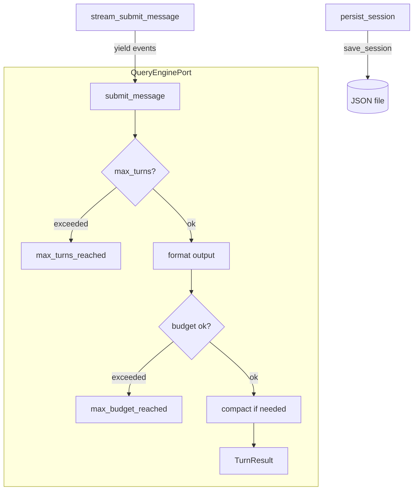

# Query Engine 實作參考

> **對應概念**：[[Agent Loop 核心執行機制]]
> **claw-code 路徑**：`src/query_engine.py`（180 行）
> **Claude Code 對應**：`src/services/api/claude.ts`（3419 行）

## 完整程式碼

```python
from __future__ import annotations

import json
from dataclasses import dataclass, field
from uuid import uuid4

from .commands import build_command_backlog
from .models import PermissionDenial, UsageSummary
from .port_manifest import PortManifest, build_port_manifest
from .session_store import StoredSession, load_session, save_session
from .tools import build_tool_backlog
from .transcript import TranscriptStore


@dataclass(frozen=True)
class QueryEngineConfig:
    max_turns: int = 8
    max_budget_tokens: int = 2000
    compact_after_turns: int = 12
    structured_output: bool = False
    structured_retry_limit: int = 2


@dataclass(frozen=True)
class TurnResult:
    prompt: str
    output: str
    matched_commands: tuple[str, ...]
    matched_tools: tuple[str, ...]
    permission_denials: tuple[PermissionDenial, ...]
    usage: UsageSummary
    stop_reason: str


@dataclass
class QueryEnginePort:
    manifest: PortManifest
    config: QueryEngineConfig = field(default_factory=QueryEngineConfig)
    session_id: str = field(default_factory=lambda: uuid4().hex)
    mutable_messages: list[str] = field(default_factory=list)
    permission_denials: list[PermissionDenial] = field(default_factory=list)
    total_usage: UsageSummary = field(default_factory=UsageSummary)
    transcript_store: TranscriptStore = field(default_factory=TranscriptStore)

    @classmethod
    def from_workspace(cls) -> 'QueryEnginePort':
        return cls(manifest=build_port_manifest())

    @classmethod
    def from_saved_session(cls, session_id: str) -> 'QueryEnginePort':
        stored = load_session(session_id)
        transcript = TranscriptStore(entries=list(stored.messages), flushed=True)
        return cls(
            manifest=build_port_manifest(),
            session_id=stored.session_id,
            mutable_messages=list(stored.messages),
            total_usage=UsageSummary(stored.input_tokens, stored.output_tokens),
            transcript_store=transcript,
        )

    def submit_message(
        self,
        prompt: str,
        matched_commands: tuple[str, ...] = (),
        matched_tools: tuple[str, ...] = (),
        denied_tools: tuple[PermissionDenial, ...] = (),
    ) -> TurnResult:
        if len(self.mutable_messages) >= self.config.max_turns:
            output = f'Max turns reached before processing prompt: {prompt}'
            return TurnResult(
                prompt=prompt,
                output=output,
                matched_commands=matched_commands,
                matched_tools=matched_tools,
                permission_denials=denied_tools,
                usage=self.total_usage,
                stop_reason='max_turns_reached',
            )

        summary_lines = [
            f'Prompt: {prompt}',
            f'Matched commands: {", ".join(matched_commands) if matched_commands else "none"}',
            f'Matched tools: {", ".join(matched_tools) if matched_tools else "none"}',
            f'Permission denials: {len(denied_tools)}',
        ]
        output = self._format_output(summary_lines)
        projected_usage = self.total_usage.add_turn(prompt, output)
        stop_reason = 'completed'
        if projected_usage.input_tokens + projected_usage.output_tokens > self.config.max_budget_tokens:
            stop_reason = 'max_budget_reached'
        self.mutable_messages.append(prompt)
        self.transcript_store.append(prompt)
        self.permission_denials.extend(denied_tools)
        self.total_usage = projected_usage
        self.compact_messages_if_needed()
        return TurnResult(
            prompt=prompt,
            output=output,
            matched_commands=matched_commands,
            matched_tools=matched_tools,
            permission_denials=denied_tools,
            usage=self.total_usage,
            stop_reason=stop_reason,
        )

    def stream_submit_message(
        self,
        prompt: str,
        matched_commands: tuple[str, ...] = (),
        matched_tools: tuple[str, ...] = (),
        denied_tools: tuple[PermissionDenial, ...] = (),
    ):
        yield {'type': 'message_start', 'session_id': self.session_id, 'prompt': prompt}
        if matched_commands:
            yield {'type': 'command_match', 'commands': matched_commands}
        if matched_tools:
            yield {'type': 'tool_match', 'tools': matched_tools}
        if denied_tools:
            yield {'type': 'permission_denial', 'denials': [denial.tool_name for denial in denied_tools]}
        result = self.submit_message(prompt, matched_commands, matched_tools, denied_tools)
        yield {'type': 'message_delta', 'text': result.output}
        yield {
            'type': 'message_stop',
            'usage': {'input_tokens': result.usage.input_tokens, 'output_tokens': result.usage.output_tokens},
            'stop_reason': result.stop_reason,
            'transcript_size': len(self.transcript_store.entries),
        }

    def compact_messages_if_needed(self) -> None:
        if len(self.mutable_messages) > self.config.compact_after_turns:
            self.mutable_messages[:] = self.mutable_messages[-self.config.compact_after_turns :]
        self.transcript_store.compact(self.config.compact_after_turns)

    def replay_user_messages(self) -> tuple[str, ...]:
        return self.transcript_store.replay()

    def flush_transcript(self) -> None:
        self.transcript_store.flush()

    def persist_session(self) -> str:
        self.flush_transcript()
        path = save_session(
            StoredSession(
                session_id=self.session_id,
                messages=tuple(self.mutable_messages),
                input_tokens=self.total_usage.input_tokens,
                output_tokens=self.total_usage.output_tokens,
            )
        )
        return str(path)

    def _format_output(self, summary_lines: list[str]) -> str:
        if self.config.structured_output:
            payload = {
                'summary': summary_lines,
                'session_id': self.session_id,
            }
            return self._render_structured_output(payload)
        return '\n'.join(summary_lines)

    def _render_structured_output(self, payload: dict[str, object]) -> str:
        last_error: Exception | None = None
        for _ in range(self.config.structured_retry_limit):
            try:
                return json.dumps(payload, indent=2)
            except (TypeError, ValueError) as exc:
                last_error = exc
                payload = {'summary': ['structured output retry'], 'session_id': self.session_id}
        raise RuntimeError('structured output rendering failed') from last_error

    def render_summary(self) -> str:
        command_backlog = build_command_backlog()
        tool_backlog = build_tool_backlog()
        sections = [
            '# Python Porting Workspace Summary',
            '',
            self.manifest.to_markdown(),
            '',
            f'Command surface: {len(command_backlog.modules)} mirrored entries',
            *command_backlog.summary_lines()[:10],
            '',
            f'Tool surface: {len(tool_backlog.modules)} mirrored entries',
            *tool_backlog.summary_lines()[:10],
            '',
            f'Session id: {self.session_id}',
            f'Conversation turns stored: {len(self.mutable_messages)}',
            f'Permission denials tracked: {len(self.permission_denials)}',
            f'Usage totals: in={self.total_usage.input_tokens} out={self.total_usage.output_tokens}',
            f'Max turns: {self.config.max_turns}',
            f'Max budget tokens: {self.config.max_budget_tokens}',
            f'Transcript flushed: {self.transcript_store.flushed}',
        ]
        return '\n'.join(sections)
```
^code-full

### 核心抽象段

```python
@dataclass(frozen=True)
class QueryEngineConfig:
    max_turns: int = 8
    max_budget_tokens: int = 2000
    compact_after_turns: int = 12

@dataclass(frozen=True)
class TurnResult:
    prompt: str
    output: str
    matched_commands: tuple[str, ...]
    matched_tools: tuple[str, ...]
    permission_denials: tuple[PermissionDenial, ...]
    usage: UsageSummary
    stop_reason: str

class QueryEnginePort:
    def submit_message(self, prompt, matched_commands, matched_tools, denied_tools) -> TurnResult:
        # ... 檢查 max_turns → 格式化輸出 → 計算 usage → 回傳 TurnResult ...

    def stream_submit_message(self, prompt, ...):
        yield {'type': 'message_start', ...}
        # ... yield streaming events ...
        yield {'type': 'message_stop', 'stop_reason': result.stop_reason, ...}
```
^code-core

## 白話解釋（逐段）

### 資料結構：QueryEngineConfig
`QueryEngineConfig` 是一個 frozen dataclass，封裝了查詢引擎的**資源限制參數**：最大回合數（`max_turns`）、token 預算上限（`max_budget_tokens`）、觸發壓縮的回合閾值（`compact_after_turns`）。這對應到 Claude Code 中散佈在 `claude.ts` 多處的 config 常數。claw-code 將它們集中為一個不可變物件，體現了「配置即資料結構」的設計思維。 #skeleton/frozen-dataclass
^explanation-structure

### 關鍵方法：submit_message
`submit_message` 是整個 Query Engine 的核心——對應 Claude Code 的 `queryModel()`。它接收 prompt 和匹配資訊，執行以下流程：
1. **檢查回合上限**：超過 `max_turns` 直接回傳 `max_turns_reached`
2. **格式化輸出**：支援純文字或 structured JSON
3. **計算 usage**：累加 token 使用量，檢查是否超出預算
4. **更新狀態**：追加 message、更新 transcript、觸發壓縮
5. **回傳 TurnResult**：包含 `stop_reason` 供上層迴圈判斷

關鍵差異：Claude Code 的 `queryModel()` 會真正呼叫 API 並 streaming 接收回應，而 claw-code 模擬了這個流程的**控制結構**。
^explanation-method

### 關鍵方法：stream_submit_message
`stream_submit_message` 用 Python generator（`yield`）模擬 Claude Code 的 streaming 回應。它依序產生 `message_start`、`command_match`、`tool_match`、`permission_denial`、`message_delta`、`message_stop` 等事件。這完美映射了 Claude API 的 SSE（Server-Sent Events）事件序列，讓讀者理解 streaming 架構而不需要真正的 HTTP 連線。
^explanation-stream

### 設計意圖
`QueryEnginePort` 的名稱中帶有 "Port"，明確標示這是一個「移植介面」而非完整實作。它保留了 Claude Code `claude.ts` 的**三大核心職責**：訊息提交（submit）、串流支援（stream）、會話持久化（persist）。透過移除 HTTP 呼叫、streaming 解碼、cache header 管理等 I/O 細節，讀者能專注理解 Query Engine 的**狀態管理**和**控制流**。
^explanation-intent

## 關鍵設計抉擇

| 設計元素 | claw-code 表現 | 對應的完整實作 |
|---------|---------------|---------------|
| API 呼叫 | 本地模擬（無 HTTP） | Claude API streaming + SSE 解碼 → [[API 呼叫層架構]] |
| 回合管理 | `max_turns` 計數器 | Async generator + context window 管理 → [[Agent Loop 核心執行機制#中斷機制]] |
| Token 預算 | `max_budget_tokens` 硬上限 | 動態 token estimation + cache 對齊 → [[Token Estimation 預估邏輯]] |
| Streaming | Python generator yield | SSE event stream + 即時 UI 更新 → [[Agent Loop 核心執行機制#設計觀察]] |
| 訊息壓縮 | 簡單截斷舊訊息 | 智慧摘要壓縮 → [[Context Compaction 壓縮策略]] |
| Session 持久化 | JSON 檔案序列化 | 複雜的 session state 管理 → [[Session Memory 即時快照]] |

^design-choices

## 精簡 vs 完整：差距分析

**這個 stub 捕捉了**（教學重點）：
- **TurnResult 資料結構**：封裝了一次 API 呼叫的完整回傳（prompt、output、matches、denials、usage、stop_reason） #teaching-point/essential
- **stop_reason 機制**：`completed`、`max_turns_reached`、`max_budget_reached` 三種終止原因 #teaching-point/essential
- **Streaming 事件序列**：message_start → match events → delta → message_stop 的完整 lifecycle #teaching-point/essential
- **訊息壓縮觸發**：`compact_after_turns` 閾值達到時自動截斷 #teaching-point/simplification

**這個 stub 省略了**（完整實作必需）：
- **真正的 LLM API 呼叫**：HTTP 請求、SSE 解碼、重試邏輯 → 見 [[API 呼叫層架構]]
- **Prompt Cache 管理**：cache header 對齊、cache break 偵測 → 見 [[Prompt Cache 策略與 Break Detection]]
- **Context Window 動態管理**：token 計算、System Prompt 組裝 → 見 [[Context Engineering 多層管道]]
- **Error Recovery**：429/529 重試、指數退避 → 見 [[Agent Loop 核心執行機制#中斷機制]]
- **多模型支援**：provider 抽象層、model selection → 見 [[模型配置與 Provider 支援]]

^gap-analysis

## Mermaid 視覺化



## 關聯筆記

- [[Agent Loop 核心執行機制]] — Query Engine 是 Agent Loop 的核心引擎（對應段落：[[Agent Loop 核心執行機制#關鍵入口點]]）
- [[API 呼叫層架構]] — Claude Code 的完整 API 呼叫實作
- [[Context Compaction 壓縮策略]] — 完整的壓縮策略（vs stub 的簡單截斷）
- [[runtime-implementation]] — PortRuntime 透過 QueryEnginePort 驅動迴圈
- [[session-store-implementation]] — Session 持久化的底層實作
- [[transcript-implementation]] — Transcript 追蹤的底層實作

---

> [!tip] 導航
> 返回 [[Implementation Reference MOC]] · [[claw-code 模組對照表]] · [[Harness Engineering MOC]]
