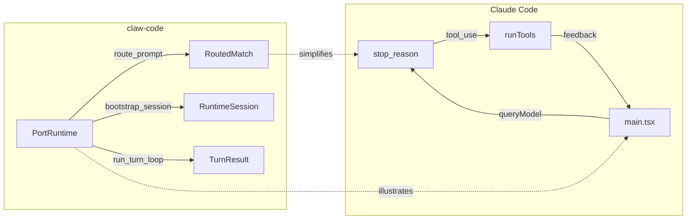

# Runtime 實作參考

> **對應概念**：[[Agent Loop 核心執行機制]]
> **claw-code 路徑**：`src/runtime.py`（200 行）
> **Claude Code 對應**：`src/main.tsx`（4683 行）

## 完整程式碼

```python
from __future__ import annotations

from dataclasses import dataclass

from .commands import PORTED_COMMANDS
from .context import PortContext, build_port_context, render_context
from .history import HistoryLog
from .models import PermissionDenial, PortingModule
from .query_engine import QueryEngineConfig, QueryEnginePort, TurnResult
from .setup import SetupReport, WorkspaceSetup, run_setup
from .system_init import build_system_init_message
from .tools import PORTED_TOOLS
from .execution_registry import build_execution_registry


@dataclass(frozen=True)
class RoutedMatch:
    kind: str
    name: str
    source_hint: str
    score: int


@dataclass
class RuntimeSession:
    prompt: str
    context: PortContext
    setup: WorkspaceSetup
    setup_report: SetupReport
    system_init_message: str
    history: HistoryLog
    routed_matches: list[RoutedMatch]
    turn_result: TurnResult
    command_execution_messages: tuple[str, ...]
    tool_execution_messages: tuple[str, ...]
    stream_events: tuple[dict[str, object], ...]
    persisted_session_path: str

    def as_markdown(self) -> str:
        lines = [
            '# Runtime Session',
            '',
            f'Prompt: {self.prompt}',
            '',
            '## Context',
            render_context(self.context),
            '',
            '## Setup',
            f'- Python: {self.setup.python_version} ({self.setup.implementation})',
            f'- Platform: {self.setup.platform_name}',
            f'- Test command: {self.setup.test_command}',
            '',
            '## Startup Steps',
            *(f'- {step}' for step in self.setup.startup_steps()),
            '',
            '## System Init',
            self.system_init_message,
            '',
            '## Routed Matches',
        ]
        if self.routed_matches:
            lines.extend(
                f'- [{match.kind}] {match.name} ({match.score}) — {match.source_hint}'
                for match in self.routed_matches
            )
        else:
            lines.append('- none')
        lines.extend([
            '',
            '## Command Execution',
            *(self.command_execution_messages or ('none',)),
            '',
            '## Tool Execution',
            *(self.tool_execution_messages or ('none',)),
            '',
            '## Stream Events',
            *(f"- {event['type']}: {event}" for event in self.stream_events),
            '',
            '## Turn Result',
            self.turn_result.output,
            '',
            f'Persisted session path: {self.persisted_session_path}',
            '',
            self.history.as_markdown(),
        ])
        return '\n'.join(lines)


class PortRuntime:
    def route_prompt(self, prompt: str, limit: int = 5) -> list[RoutedMatch]:
        tokens = {token.lower() for token in prompt.replace('/', ' ').replace('-', ' ').split() if token}
        by_kind = {
            'command': self._collect_matches(tokens, PORTED_COMMANDS, 'command'),
            'tool': self._collect_matches(tokens, PORTED_TOOLS, 'tool'),
        }

        selected: list[RoutedMatch] = []
        for kind in ('command', 'tool'):
            if by_kind[kind]:
                selected.append(by_kind[kind].pop(0))

        leftovers = sorted(
            [match for matches in by_kind.values() for match in matches],
            key=lambda item: (-item.score, item.kind, item.name),
        )
        selected.extend(leftovers[: max(0, limit - len(selected))])
        return selected[:limit]

    def bootstrap_session(self, prompt: str, limit: int = 5) -> RuntimeSession:
        context = build_port_context()
        setup_report = run_setup(trusted=True)
        setup = setup_report.setup
        history = HistoryLog()
        engine = QueryEnginePort.from_workspace()
        history.add('context', f'python_files={context.python_file_count}, archive_available={context.archive_available}')
        history.add('registry', f'commands={len(PORTED_COMMANDS)}, tools={len(PORTED_TOOLS)}')
        matches = self.route_prompt(prompt, limit=limit)
        registry = build_execution_registry()
        command_execs = tuple(registry.command(match.name).execute(prompt) for match in matches if match.kind == 'command' and registry.command(match.name))
        tool_execs = tuple(registry.tool(match.name).execute(prompt) for match in matches if match.kind == 'tool' and registry.tool(match.name))
        denials = tuple(self._infer_permission_denials(matches))
        stream_events = tuple(engine.stream_submit_message(
            prompt,
            matched_commands=tuple(match.name for match in matches if match.kind == 'command'),
            matched_tools=tuple(match.name for match in matches if match.kind == 'tool'),
            denied_tools=denials,
        ))
        turn_result = engine.submit_message(
            prompt,
            matched_commands=tuple(match.name for match in matches if match.kind == 'command'),
            matched_tools=tuple(match.name for match in matches if match.kind == 'tool'),
            denied_tools=denials,
        )
        persisted_session_path = engine.persist_session()
        history.add('routing', f'matches={len(matches)} for prompt={prompt!r}')
        history.add('execution', f'command_execs={len(command_execs)} tool_execs={len(tool_execs)}')
        history.add('turn', f'commands={len(turn_result.matched_commands)} tools={len(turn_result.matched_tools)} denials={len(turn_result.permission_denials)} stop={turn_result.stop_reason}')
        history.add('session_store', persisted_session_path)
        return RuntimeSession(
            prompt=prompt,
            context=context,
            setup=setup,
            setup_report=setup_report,
            system_init_message=build_system_init_message(trusted=True),
            history=history,
            routed_matches=matches,
            turn_result=turn_result,
            command_execution_messages=command_execs,
            tool_execution_messages=tool_execs,
            stream_events=stream_events,
            persisted_session_path=persisted_session_path,
        )

    def run_turn_loop(self, prompt: str, limit: int = 5, max_turns: int = 3, structured_output: bool = False) -> list[TurnResult]:
        engine = QueryEnginePort.from_workspace()
        engine.config = QueryEngineConfig(max_turns=max_turns, structured_output=structured_output)
        matches = self.route_prompt(prompt, limit=limit)
        command_names = tuple(match.name for match in matches if match.kind == 'command')
        tool_names = tuple(match.name for match in matches if match.kind == 'tool')
        results: list[TurnResult] = []
        for turn in range(max_turns):
            turn_prompt = prompt if turn == 0 else f'{prompt} [turn {turn + 1}]'
            result = engine.submit_message(turn_prompt, command_names, tool_names, ())
            results.append(result)
            if result.stop_reason != 'completed':
                break
        return results

    def _infer_permission_denials(self, matches: list[RoutedMatch]) -> list[PermissionDenial]:
        denials: list[PermissionDenial] = []
        for match in matches:
            if match.kind == 'tool' and 'bash' in match.name.lower():
                denials.append(PermissionDenial(tool_name=match.name, reason='destructive shell execution remains gated in the Python port'))
        return denials

    def _collect_matches(self, tokens: set[str], modules: tuple[PortingModule, ...], kind: str) -> list[RoutedMatch]:
        matches: list[RoutedMatch] = []
        for module in modules:
            score = self._score(tokens, module)
            if score > 0:
                matches.append(RoutedMatch(kind=kind, name=module.name, source_hint=module.source_hint, score=score))
        matches.sort(key=lambda item: (-item.score, item.name))
        return matches

    @staticmethod
    def _score(tokens: set[str], module: PortingModule) -> int:
        haystacks = [module.name.lower(), module.source_hint.lower(), module.responsibility.lower()]
        score = 0
        for token in tokens:
            if any(token in haystack for haystack in haystacks):
                score += 1
        return score
```
^code-full

### 核心抽象段

```python
class PortRuntime:
    def route_prompt(self, prompt: str, limit: int = 5) -> list[RoutedMatch]:
        tokens = {token.lower() for token in prompt.replace('/', ' ').replace('-', ' ').split() if token}
        by_kind = {
            'command': self._collect_matches(tokens, PORTED_COMMANDS, 'command'),
            'tool': self._collect_matches(tokens, PORTED_TOOLS, 'tool'),
        }
        # ... 評分後選取最佳匹配 ...
        return selected[:limit]

    def run_turn_loop(self, prompt: str, limit: int = 5, max_turns: int = 3, structured_output: bool = False) -> list[TurnResult]:
        # ... 多回合執行迴圈 ...
        for turn in range(max_turns):
            result = engine.submit_message(turn_prompt, command_names, tool_names, ())
            results.append(result)
            if result.stop_reason != 'completed':
                break
        return results
```
^code-core

## 白話解釋（逐段）

### 資料結構：RoutedMatch
`RoutedMatch` 是一個 frozen dataclass，代表「prompt 路由後的匹配結果」。它記錄了匹配的類型（command 或 tool）、名稱、來源提示和評分。這對應到 Claude Code 中 Agent Loop 接收用戶輸入後決定「下一步做什麼」的路由階段。 #skeleton/frozen-dataclass
^explanation-structure

### 關鍵方法：route_prompt
`route_prompt` 將用戶輸入拆成 token，對所有已註冊的 commands 和 tools 做模糊匹配評分。每種類型至少選一個最高分的匹配，再從剩餘候選中補足到 `limit` 數量。這是 Claude Code 中 Agent Loop 決定「呼叫哪些工具」的簡化版。在完整實作中，這一步由模型的 tool_use 回傳驅動，而非 token 匹配。
^explanation-method

### 關鍵方法：run_turn_loop
`run_turn_loop` 是整個 Agent Loop 的最小可行抽象。它建立 `QueryEnginePort`，執行 prompt 路由，然後進入**多回合迴圈**：每回合呼叫 `submit_message`，根據 `stop_reason` 決定繼續或停止。這完美對應了 Claude Code 中 `queryModel() → stop_reason → runTools() → feedback → queryModel()` 的核心循環。 #maps-to/agent-loop
^explanation-loop

### 設計意圖
`PortRuntime` 將 Agent Loop 的三個核心職責壓縮到一個類別：**路由**（route_prompt）、**會話管理**（bootstrap_session）、**迴圈執行**（run_turn_loop）。在 Claude Code 中，這三個職責分散在 `main.tsx`（4683 行）的多個函式中。claw-code 的極簡化讓讀者能一眼看清 Agent Loop 的骨幹，不被 streaming、error handling、permission check 等細節淹沒。
^explanation-intent

## 關鍵設計抉擇

| 設計元素 | claw-code 表現 | 對應的完整實作 |
|---------|---------------|---------------|
| Prompt 路由 | Token 匹配 + 評分排序 | 模型 API 回傳 `tool_use` stop_reason → [[Agent Loop 核心執行機制#關鍵入口點]] |
| Turn Loop | `for turn in range(max_turns)` 簡單迴圈 | Async generator + streaming + interrupt handling → [[Agent Loop 核心執行機制#Feedback Loop 機制]] |
| Session 狀態 | `RuntimeSession` dataclass 聚合所有欄位 | 分散在多個 service 模組（State, History, Transcript） |
| 權限推斷 | 硬編碼 `bash` → deny | 多層權限引擎 → [[權限規則引擎]] |
| 工具執行 | 透過 `execution_registry` 同步呼叫 | 並行/串行策略 + 7 層防護 → [[Tool Orchestration 調度系統]] |

^design-choices

## 精簡 vs 完整：差距分析

**這個 stub 捕捉了**（教學重點）：
- Agent Loop 的**三階段結構**：路由 → 執行 → 回合管理 #teaching-point/essential
- `stop_reason` 驅動的**迴圈控制**：`completed` 繼續、其他停止 #teaching-point/essential
- Session 作為**狀態容器**：聚合 context、setup、history、turn result #teaching-point/essential

**這個 stub 省略了**（完整實作必需）：
- **Streaming**：Claude Code 使用 async generator 逐步 yield 回應 → 見 [[Agent Loop 核心執行機制#設計觀察]]
- **中斷機制**：Ctrl+C、token 超限、API 錯誤的優雅處理 → 見 [[Agent Loop 核心執行機制#中斷機制]]
- **Context Engineering**：6 大管道的 System Prompt 組裝 → 見 [[Context Engineering 多層管道]]
- **Observability**：每個階段的追蹤與遙測 → 見 [[Observability 三層可觀測性架構]]
- **真正的 LLM 呼叫**：stub 模擬匹配，Claude Code 由 API 回傳驅動決策

^gap-analysis

## Mermaid 視覺化



## 關聯筆記

- [[Agent Loop 核心執行機制]] — 完整概念說明（對應段落：[[Agent Loop 核心執行機制#整體流程]]）
- [[Context Engineering 多層管道]] — Agent Loop 的「輸入準備」階段
- [[Tool Orchestration 調度系統]] — Agent Loop 的「工具執行」階段
- [[query-engine-implementation]] — QueryEnginePort 實作（Runtime 的核心依賴）
- [[tool-implementation]] — ToolDefinition 實作（路由的匹配對象）
- [[Harness Engineering 12 原則]] — Runtime 體現的 Harness 設計原則

---

> [!tip] 導航
> 返回 [[Implementation Reference MOC]] · [[claw-code 模組對照表]] · [[Harness Engineering MOC]]
